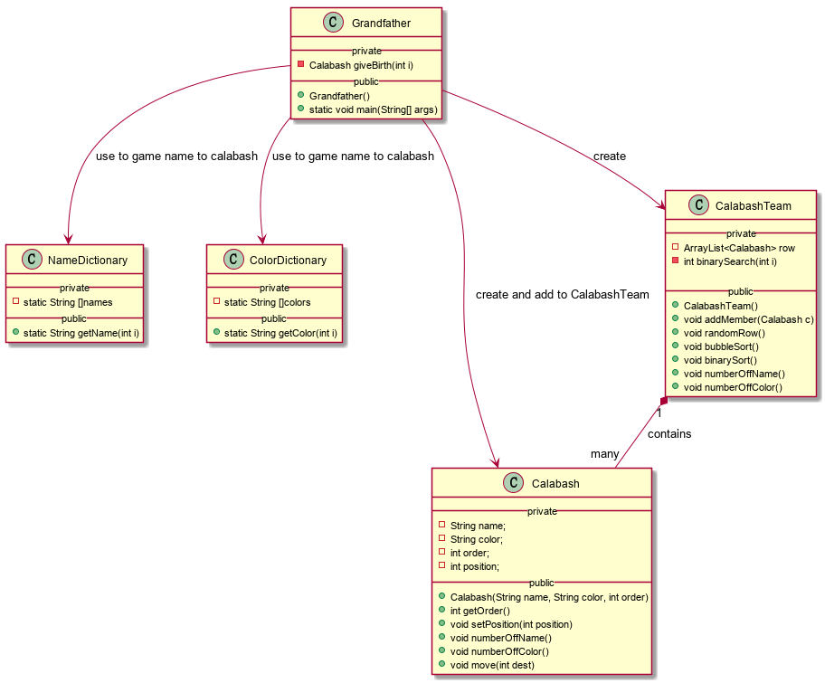

# **一、解决问题的思路(面向对象程序设计)**
## **1. 对象的选取**
        面向对象程序设计中，Everything is an object，找到问题的基本对象和他们之间的相互关系十分重要，而对象的寻找可借助问题描述中的动作行为，动作的执行者就是对象。根据对象的相同特征划分成类。  
        从问题中可以找到以下动作：  
            随意站队  
            排序  
            交换位置(也可拆分成两个位置移动)  
            报告交换动作  
            报数
        其中位置移动、报告交换动作均由单个葫芦娃执行，因此葫芦娃可选作一个类别——葫芦娃类；随意站队和排序需要依附一个由7个葫芦娃组成的队伍，在这个队伍中可以对葫芦娃们打乱站队顺序，排序和报数，所以可创建一个葫芦娃队伍类(相当于抽象的排序机器)；除此之外，问题的描述中隐藏着一个对象，他对队伍发出指令、随意站队、排序和报数，不妨设置成葫芦娃的爷爷。
## **2.确定对象属性和方法**
        (1)葫芦娃：对象类型为葫芦娃类  
            属性：排行、颜色、在队伍中的位置
            方法：按名字报数、按颜色报数、移动位置并报告位置变化
        (2)葫芦娃队伍：对象类型为葫芦娃队伍类
            属性：7个葫芦娃
            方法：7个葫芦娃随机站队、冒泡排序、二分排序、报数
        (3)爷爷：对象类型为爷爷类
            属性：一个葫芦娃队伍
            方法：main方法，发出指令  

# 二、版本更新

### 1.类图修改：

### 2.模块化和封装

(1)模块化：与第一个版本相比，此次更新根据对象划分模块，将原来的单个文件拆分成多个文件。

(2)封装：理清对象具有的属性和方法，提供给外部合适的接口。

### 3.设计思路的改良

(1)class Grandfather充当上帝的角色。可以创建葫芦娃，为葫芦娃赋予姓名、颜色和排行(giveBirth方法)；创建葫芦娃队伍，将葫芦娃添加进葫芦娃队伍；指挥葫芦娃队伍打乱队列、排序和报数。

(2)第一版中将所有的name和color作为葫芦娃类的静态属性，这是不合理的，更贴近现实的应该是有一本取名和取颜色的词典，通过查阅词典获得名字和颜色，因此设计了NameDictionary和ColorDictionary两个类；同时第一版中葫芦娃的构造方法需要输入int i，在构造函数中根据i获得名字和颜色，这也是不合理的，葫芦娃出生应该是直接赋予名字和颜色，而不是让葫芦娃自己找属于自己的名字和颜色，因此修改了葫芦娃的构造方法，并通过Grandfather的giveBirth方法创造葫芦娃。