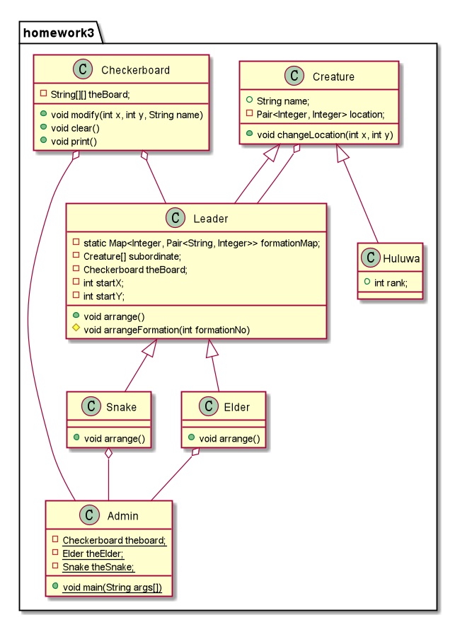

**本次实验中的代码主要使用了封装、继承、聚类、多态等面向对象中的机制**

## 结构
主要有一下几个类：
1. CheckerBoard：棋盘类，记录各生物的位置并进行打印
2. Creature：所有生物的基类，同时小喽啰和蝎子精直接使用该类创建（因为小喽啰无需额外的属性和方法），具有记录姓名`name`、位置`location`的属性和改变位置的方法`changeLocation`
3. Huluwa：继承自Creature，因为葫芦娃本身是有序的，因此在基类的基础上添加`rank`属性以显示顺序
4. Leader：是老人和蛇精两个类的基类，同时该类也直接继承自Creature，在此基础上添加属性：属下`subordinate`,即Creature数组，这里应用了多态特性，方便管理和使用。以及公共的用于调用的安排队形的方法`arrange`(这里的arrange不含实际内容，仅用于提供接口)和私有的具体设置队形的八个阵型对应的方法（此处略）
5. Elder和Snake：继承自Leader，在其基础上overwrite原有的`arrange`方法以实现各自的排兵布阵策略
6. Admin：实际上用于控制本程序的类，其中有`main`函数，分别创建棋盘和两方领导者，两方领导者再调用`arrange`分别进行决定阵型、实际召唤（创建出）需要的手下、排布阵型的操作，其后调用CheckBoard的打印函数进行打印

结构如图所示

## 设计理念
1. 采用封装，避免外部对象修改对象内部的状态，从而引起对象本身的稳定性的损害。
2. 继承：使不同的类，有相同的方法，以最大程度地重用代码。
3. 多态：以相同的方法处理不同对象的行为，使程序易读易用