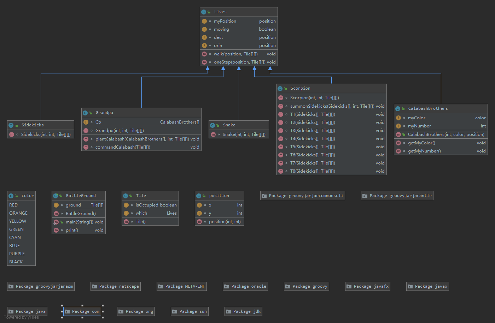

# 面向对象的设计
1. 程序中主要设计了一个Lives父类，所有生命体都是Lives父类的子类，存在继承关系。Lives类中封装了每个生命体有其存在的位置，此外每个生命体存在一个状态moving,代表此生命体是否在移动中，如果在移动中，该生命体则没有属于自己的地砖，但是有属于自己的位置和自己的目的地与初始位置。类中封装了移动方法walk和onestep，walk中主要实现了走路的方向。onestep则实现了每一步如何移动。如果去往的地砖没有拥有者，则对自己原来所在的地砖失去拥有权，去往的下一步地砖的拥有者变为自己。如果去往的地砖原来就有拥有者则自己进入moving态
，判断这个地砖是不是自己的最终目的，如果是的话和拥有者交流，拥有者变为moving态，自己占有拥有者原有的地砖。拥有者开始寻找自己的
地砖，考虑到有可能所有人占满了地砖，所以原来的拥有者会前往初始移动人的初始位置。如果去往的地砖原来就有拥有者且不是自己的目的地
则自己进入moving态，moving态没有自己的地砖，继续移动。实现了类似现实生活中人类排队时的移动准则。
2. 程序中设计了Scorpion类，为lives的子类，其中封装了指挥小怪移动的阵型，为依照Scorpion占有的位置计算相对位置的方法。小怪有其
sidekicks类，小怪的召唤由Scorpion完成。
3. 程序中设计了grandpa类，为lives的子类，封装了种葫芦籽和指挥葫芦娃的功能。在战场上，grandpa对象首先在自己周围一圈种七个葫芦，
战斗开始后可以用指挥功能指挥葫芦娃排成长蛇阵。calabash类由grandpa的召唤创建。grandpa还有加油功能。
4. 程序中设计了snake类，为lives的子类。可以加油。
5. 战斗的主战场battleground类，该类为16X16的地砖构成。每个地砖由地砖类创建，地砖有其拥有者。拥有者其位置和地砖的拥有者互相对应。
battleground还有输出战场形势的功能。