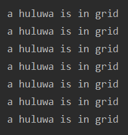

# 葫芦大战妖精

## UML 一览


## 模块划分

### package chessman

* 这个包里面是棋盘上可以行动的生物集合；

* 对外接口类

  * MonsterList：这是一个初始化信息存储类，负责对所有Evil类对象初始化，并提供给外部调用者；本次存储了蝎子精、蛇精、喽啰的信息；
  * JusticeList：这是一个初始化信息存储类，负责对所有Justice类对象初始化，并提供给外部调用者；本次存储了葫芦娃、爷爷的信息；
  
* 内部使用类

  * Creature：这是一个基类，包含了自身的属性信息，如是阵营等；
  * CreatureState：这是一个枚举类，定义了生物的三种状态：就绪态、有生命、去世了；
  * Grandpa，Huluwa，Pawn：爷爷、葫芦娃、反派；

  

### package chessboard

* 这个包里面是战场及其相关的类；

* 所有类：
  * Ground：是一个N*M的矩形棋盘战场，每一格上可以战立一个生物；允许外部类向其请求添加棋子或移出棋子；
  * Formation：保存各个阵型的关键坐标，可以设置其校准点，其余位置将根据中心点递推；外部类可以向其获取一个阵型第n个位置的坐标；
  * Grid：是N\*M的矩阵棋盘上的一格，保存了一个生物的信息；
  * Position：保存了N\*M的矩阵棋盘上的一个坐标信息(x, y)；
  * GameMaster：创建棋盘战场，创建棋子，接受外部命令，设置阵型；


## 设计原则

### SRP (The Single-Responsibility Principle) 单一职责原则  

* *A class  should have only one reason to change.*
* `class Ground`当且仅当有棋子移动时发生变化；
* `class Creature`当且仅当生物信息发生变化时，负责信息访问或修改信息；
* `class MonsterList`当切仅当`class BattleEvent`初始化棋盘上活动生物时提供初始化生物服务；


### LSP (The Liskov Substitution Principle) Liskov替换原则

* *Subtypes must be substitutable for their base types.*
* 对于`package chessman`以外的对象来说，它们只需要知道`abstract class Creature`制定的规范，不需要知道具体生物有哪几种

## 继承

根据CARP(Composition/Aggregation Reuse Principle) 合成/聚合复用原则，在设计中尽可能避免了继承，可以看到整个框架中只有`package chessman`中的生物进行了继承；


## 集合类型

需要注意的是，虚线框都是`abstract`类，在实现`class FindPath`可到达判断的算法时曾经想要使用`queue`，结果发现必须用它的实现类初始化才可以使用，因此实际使用中，初始化一定用实现类，如`Vector`、`ArrayList`、etc..

其更多综合应用在下面的泛型中


在`class JusticeList`中，使用了`abstract class List`，并用其实现类`class ArrayList`初始化

```java
 public List<Justice> HuluCollection = new ArrayList<Justice>();
```


## 泛型

曾经在`class Grid`中实验参数类的通配符与擦除，通过`T extends Creature`使得可以在`isBlock`中调用`Creature`的方法，同时Java泛型的实现方式就是将类型参数用边界类型替换，在下面的例子中就是把`T`用`Creature`替换。这种实现方式看上去就像是把具体的类型（葫芦娃、妖精），擦除到了边界类型（它们的父类`Creature`)：

```java
public class Grid <T extends Creature>{
    private Creature x;

    public Grid() {
        x = null;
    }

    public boolean isEmpty() {
        return (x == null);
    }

    public Creature get() {
        return x;
    }

    public void clear() {
        x = null;
    }

    public void set(T x) {
        this.x = x;
    }

    public boolean isBlock() {
        return (x == null) || (x.getState() == State.DEAD);
    }
}
```

上面是在类定义的时候引入通配符，在使用类定义时没有边界类型的参数类时，做了下面实现：

```java
public void setBattlePlace(BattleField field,ArrayList<? extends Creature>hululist,ArrayList<? extends Creature>monsterlist){
        //put the evil and justice onto battleField
        int i = 0;
        for(Creature creature:monsterlist){
            creature.setPosition(i+1,11);
            field.setCreatrue(creature,1+i,11);
            i++;
        }
        i = 0 ;

        for(Creature creature:hululist){
            creature.setPosition(list[i].getX()-1,list[i].getY()+2);
            field.setCreatrue(creature,list[i].getX()-1,list[i].getY()+2);
            i++;
        }
    }
```

可能会向`ArrayList<? extends Creature> hululist`传入`ArrayList<Justice>`的参数，可以由下面的例子看到，使用了`extends`的`hululist`不能存入任何元素，但是没有关系，`setBattlePlace`中巧妙地避免了这一个问题，因为棋盘上的生物始终是固定不变的，我们只需要通过`foreach`访问`hululist`中的`creature`引用，并不需要再增加或减少生物的个数：

```java
class Fruit{}
class Apple extends Fruit{}
public class GenericsAndCovariance {
    public static void main(String[] args){
    Plate<? extends Fruit> p=new Plate<Apple>(new Apple());
    
        //不能存入任何元素
        p.set(new Fruit());    //Error
        p.set(new Apple());    //Error
        //读取出来的东西只能存放在Fruit或它的基类里。
        Fruit newFruit1=p.get();
        Object newFruit2=p.get();
        Apple newFruit3=p.get();    //Error
    }
}
```

```java
public static void main(String[] args) {
        Computer<SSD> computer = new Computer<SSD>(new SSD());
        SSD disk = computer.getDisk(); // No cast needed
        //computer.setDisk(new HHD()); // error!
        computer.setDisk(new SSD());

        Computer<HHD> computer_ = new Computer<HHD>(new HHD());
        HHD disk_ = computer_.getDisk(); // No cast needed
        computer_.setDisk(new HHD());

        Computer<? extends Disk> a =  new Computer<HHD>(new HHD());
        //a.setDisk(new HHD());//error
        //HHD aa=a.getDisk();//error
        Disk aaa=a.getDisk();

```


## 反射

反射的核心是 JVM 在运行时才动态加载类或调用方法/访问属性，它不需要事先（写代码的时候或编译期）知道运行对象是谁。

* 在运行时判断任意一个对象所属的类；

* 在运行时构造任意一个类的对象；

* 在运行时判断任意一个类所具有的成员变量和方法

* 在运行时调用任意一个对象的方法

在本次实验中用到了类型检查，作为Grid边界擦除实际效果的测试、探索了Java中的引用与擦除机制：

```java
 public void set(T x) {
        if(Huluwa.class.isInstance(x))
            System.out.println("a huluwa is in grid");
        this.x = x;
    }
```

可以观察到尽管葫芦娃在进入格子中被替换成了边界类型，set函数中任然触发了输出语句，可见其本质依然是引用指向葫芦娃原来的存储空间：




