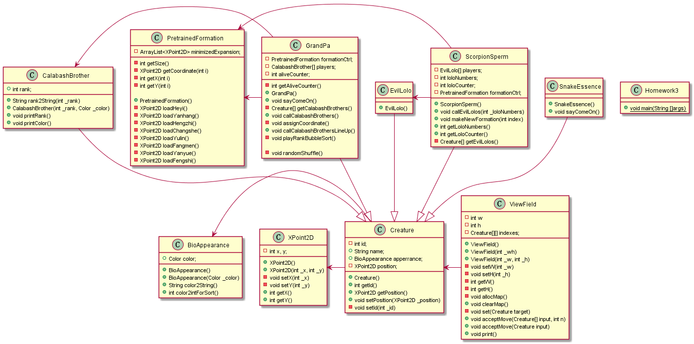

# Java-2019 作业三

## 171860633 徐国栋

## 任务简述

* 1、在 N × N 空间内构造 8 种阵型

* 2、控制阵型位置，形成对峙效果

* 3、用面向对象的设计思想完成任务1和任务2

## 设计思路

### UML图



### 阵型的模拟

设置阵型类，需要记录8种阵型的归一化坐标，通过load函数返回阵型占用的尺寸
```java
public class PretrainedFormation {
    private ArrayList<XPoint2D> minimizedExpansion;
    ...
    // 加载阵型 1-7:特殊阵型，其它:长蛇阵，返回阵型占用的尺寸
    public XPoint2D load(int i) {...}
    private XPoint2D loadHeyi() {...}
    ...
}
```

### 场地的模拟

设置视场类，维护一个 N × N 场景，因为控制台打印的特殊性，即必须从左往右、从上到下打印，视场类需要知道生物体的精确位置（不像GUI那样支持随机绘制），视场类通过acceptMove(Creature[] input, int n)函数获得生物体位置信息和名称，通过 N × N 遍历进行打印。acceptMove函数的调用涉及**转型**，传入的是继承生物类的派生类，体现面向对象的**多态**特性
```java
public class ViewField {
    private int w, h;
    ...
    private Creature[][] indexes;
    private void allocMap() {...}
    public void clearMap() {...}
    public void acceptMove(Creature[] input, int n) {... }
    public void acceptMove(Creature input) {...}
    ...
    public void print() {... }
}
```

### 人物外观的模拟

人物拥有颜色属性，使用外观类记录颜色，记录后期渲染需要的图片
```java
public class BioAppearance {
    public Color color;
    ...
}
```

### 生物的模拟

采用**派生**的方式描述不同生物，编写生物类为基类，记录共有的信息
```java
public class Creature { 
    private int id;
    public String name; 
    public BioAppearance apperrance; 
    ...
}
```

对于葫芦娃，拥有特有的家族排行，同时编写两个映射函数获取家族排行和颜色的中文名用于展示
```java
final class CalabashBrother extends Creature {
    public int rank; 
     public String rank2String(int _rank) {...}
     public String color2String() {...}
    ...
}
```

对于老爷爷和蝎子精，让他们做阵型的创造者，设置老爷爷类、蝎子精类，**继承**生物类，包含阵型类的实例，(class GrandPa)(class ScorpionSperm)和(class PretrainedFormation)是**聚合**关系；老爷爷类包含7个葫芦娃类实例，蝎子精类包含可动态调整数量的小喽啰类实例，老爷爷和蝎子精通过阵型类生成的坐标，告诉手下应该待在什么位置
```java
final class GrandPa extends Creature {
    private PretrainedFormation formationCtrl;
    private CalabashBrother[] players;
    ...
    public void sayComeOn() {... }
    public void callCalabashBrothers() {...}
    ...
    public void callCalabashBrothersLineUp() {...}
    ...
    private void playRankBubbleSort() {...}
    private void randomShuffle() {...}
}
final class ScorpionSperm extends Creature {
    EvilLolo[] players;
    private PretrainedFormation formationCtrl;
    ...
    public void callEvilLolos(int _loloNumbers) {...}
    public void makeNewFormation(int index) {...}
    ...
}
```

## 结果展示

```
（场景 0）：蛇精、老爷爷进场，葫芦娃乱序排队  
（画外音）Gp: 我是老爷爷，我在给我的葫芦娃加油  
---------------------------------------  
         Gp          Ss  
  
      H5  
      H3  
      H7  
      H2  
      H6  
      H4  
      H1                                 
  
  
  
  
---------------------------------------  
（场景 1）: 蛇精、老爷爷在场，葫芦娃保持长蛇阵，蝎子精和小喽啰变换阵型  
（画外音）Gp: 我是老爷爷，我在给我的葫芦娃加油  
（画外音）Ss: 我是蛇精，我在给我的蝎子精加油  
---------------------------------------  
         Gp          Ss  
  
      H1                Xz  
      H2             *.    *.  
      H3          *.          *.         
      H4             *.    *.  
      H5                *.  
      H6  
      H7  
  
  
  
  
---------------------------------------  
（场景 2）: 蛇精、老爷爷在场，葫芦娃保持长蛇阵，蝎子精和小喽啰变换阵型  
（画外音）Gp: 我是老爷爷，我在给我的葫芦娃加油  
（画外音）Ss: 我是蛇精，我在给我的蝎子精加油  
---------------------------------------  
         Gp          Ss  
  
      H1                *.  
      H2             *. *. *.  
      H3          Xz    *.    *.         
      H4          *.    *.    *.  
      H5                *.  
      H6                *.  
      H7  
  
  
  
  
---------------------------------------  
（场景 3）: 蛇精、老爷爷在场，葫芦娃保持长蛇阵，蝎子精和小喽啰变换阵型  
（画外音）Gp: 我是老爷爷，我在给我的葫芦娃加油  
（画外音）Ss: 我是蛇精，我在给我的蝎子精加油  
---------------------------------------  
         Gp          Ss  
  
      H1             Xz                  
      H2          *.  
      H3             *.  
      H4          *.  
      H5             *.  
      H6          *.  
      H7  
  
  
  
  
---------------------------------------  
（场景 4）: 蛇精、老爷爷在场，葫芦娃保持长蛇阵，蝎子精和小喽啰变换阵型  
（画外音）Gp: 我是老爷爷，我在给我的葫芦娃加油  
（画外音）Ss: 我是蛇精，我在给我的蝎子精加油  
---------------------------------------  
         Gp          Ss  
  
      H1          Xz                *.   
      H2             *.          *.      
      H3                *.    *.  
      H4                   *.  
      H5  
      H6  
      H7  
  
  
  
  
---------------------------------------  
（场景 5）: 蛇精、老爷爷在场，葫芦娃保持长蛇阵，蝎子精和小喽啰变换阵型  
（画外音）Gp: 我是老爷爷，我在给我的葫芦娃加油  
（画外音）Ss: 我是蛇精，我在给我的蝎子精加油  
---------------------------------------  
         Gp          Ss  
  
      H1                      Xz         
      H2                   *.  
      H3                *.  
      H4             *.  
      H5          *.  
      H6  
      H7  
  
                                         
  
  
---------------------------------------  
（场景 6）: 蛇精、老爷爷在场，葫芦娃保持长蛇阵，蝎子精和小喽啰变换阵型  
（画外音）Gp: 我是老爷爷，我在给我的葫芦娃加油  
（画外音）Ss: 我是蛇精，我在给我的蝎子精加油  
---------------------------------------  
         Gp          Ss                  
  
      H1                      *.  
      H2                *. *.  
      H3             *. *.  
      H4          Xz *. *.  
      H5          *. *. *.  
      H6          *. *. *.  
      H7             *. *.  
                        *. *.  
                              *.         
  
  
---------------------------------------  
（场景 7）: 蛇精、老爷爷在场，葫芦娃保持长蛇阵，蝎子精和小喽啰变换阵型  
（画外音）Gp: 我是老爷爷，我在给我的葫芦娃加油  
（画外音）Ss: 我是蛇精，我在给我的蝎子精加油  
---------------------------------------  
         Gp          Ss  
  
      H1             Xz  
      H2                *.  
      H3             *. *. *.  
      H4          *. *. *. *.  
      H5             *.  
      H6  
      H7  
  
  
  
  
---------------------------------------  
```