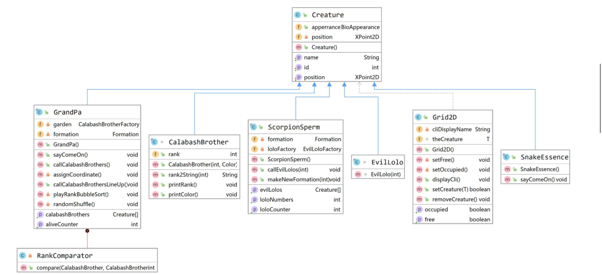
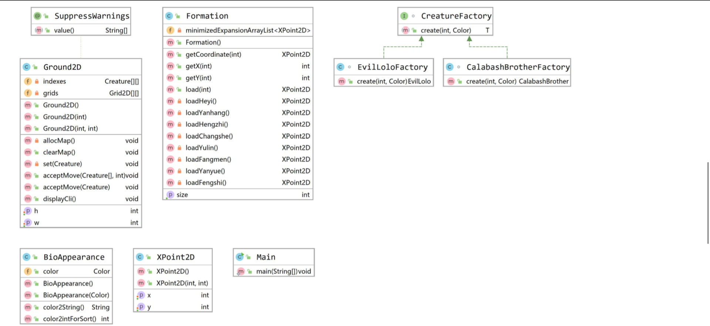

# Java-2019 作业四  
  
## 171860633 徐国栋  
  
## 任务简述  
  
* 在作业三的基础上，加入反射和泛型  
  
## 设计思路  
  
* 1、Grid2D使用了泛型，即Grid2D\<T extends Creature\>，地面Ground2D类包含Grid2D类组成的二维数组作为人物位置，通过setCreature(T newCreature)方法将喽啰、葫芦娃、蝎子精等生物布置到地面位置  
  
* 2、采用工厂类生成葫芦娃、小喽啰的实例，具体地，CalabashBrotherFactory、EvilLoloFactory实现接口CreatureFactory<T>的抽象方法T create(int rank, Color color)，老爷爷、蝎子精持有CalabashBrotherFactory、EvilLoloFactory类的实例garden和loloFactory，通过garden和loloFactory生成葫芦娃、小喽啰的实例。  
  
* 3、反射用在地图人物计数和打印人物拥有的方法上面。设置ReflectionTester类管理反射的使用，通过 Class<?> currentHolder = grids[i][j].getTheCreature().getClass() 获取地图上一个位置上生物T的类型；通过getDeclaredMethods()打印人物拥有的方法。在地图人物计数方面，使用反射不是必须的，通过老爷爷和蝎子精类同样可以获取人物计数。  

## 类图  
  
* 1、生物类及其继承关系  
  
  
* 2、其他以来关系  
  
  
## 运行  
  
* windows系统双击compile.bat自动编译，双击clean.bat清除中间文件  
  
* compile.bat文件内容: dir /s /b *.java > sources.txt && javac -encoding utf8 @sources.txt && echo compile done and press enter to run && pause && cd src && java Main && cd ../ && pause  
  
* clean.bat文件内容: del /s /q *.class && echo clean done. && pause  
  
## 结果展示  
  
  
Microsoft Windows [版本 10.0.18363.418]  
(c) 2019 Microsoft Corporation。保留所有权利。  
  
C:\Users\xgd\source\repos\java2019-homework\4-Types\徐国栋-171860633>compile.bat  
  
compile done and press enter to run  
请按任意键继续. . .  
creature.ScorpionSperm拥有的方法：  
----------------------------------------  
public void creature.ScorpionSperm.makeNewFormation(int)  
public creature.Creature[] creature.ScorpionSperm.getEvilLolos()  
public void creature.ScorpionSperm.callEvilLolos(int)  
public int creature.ScorpionSperm.getLoloNumbers()  
public int creature.ScorpionSperm.getLoloCounter()  
----------------------------------------  
（场景 0）：蛇精、老爷爷进场，葫芦娃乱序排队  
（画外音）Gp: 我是老爷爷，我在给我的葫芦娃加油  
---------------------------------------  
Xz       Gp          Ss  
  
      H7  
      H3  
      H5  
      H2  
      H1  
      H6  
      H4  
  
  
  
  
---------------------------------------  
运行时通过反射计数：  
CalabashBrother：7；  
EvilLolo：0；  
Scorpion：1；  
（场景 1）: 蛇精、老爷爷在场，葫芦娃保持长蛇阵，蝎子精和小喽啰变换阵型  
（画外音）Gp: 我是老爷爷，我在给我的葫芦娃加油  
（画外音）Ss: 我是蛇精，我在给我的蝎子精加油  
---------------------------------------  
         Gp          Ss  
  
      H1                Xz  
      H2             *.    *.  
      H3          *.          *.  
      H4             *.    *.  
      H5                *.  
      H6  
      H7  
  
  
  
  
---------------------------------------  
运行时通过反射计数：  
CalabashBrother：7；  
EvilLolo：7；  
Scorpion：1；  
（场景 2）: 蛇精、老爷爷在场，葫芦娃保持长蛇阵，蝎子精和小喽啰变换阵型  
（画外音）Gp: 我是老爷爷，我在给我的葫芦娃加油  
（画外音）Ss: 我是蛇精，我在给我的蝎子精加油  
---------------------------------------  
         Gp          Ss  
  
      H1                *.  
      H2             *. *. *.  
      H3          Xz    *.    *.  
      H4          *.    *.    *.  
      H5                *.  
      H6                *.  
      H7  
  
  
  
  
---------------------------------------  
运行时通过反射计数：  
CalabashBrother：7；  
EvilLolo：11；  
Scorpion：1；  
（场景 3）: 蛇精、老爷爷在场，葫芦娃保持长蛇阵，蝎子精和小喽啰变换阵型  
（画外音）Gp: 我是老爷爷，我在给我的葫芦娃加油  
（画外音）Ss: 我是蛇精，我在给我的蝎子精加油  
---------------------------------------  
         Gp          Ss  
  
      H1             Xz  
      H2          *.  
      H3             *.  
      H4          *.  
      H5             *.  
      H6          *.  
      H7  
  
  
  
  
---------------------------------------  
运行时通过反射计数：  
CalabashBrother：7；  
EvilLolo：5；  
Scorpion：1；  
（场景 4）: 蛇精、老爷爷在场，葫芦娃保持长蛇阵，蝎子精和小喽啰变换阵型  
（画外音）Gp: 我是老爷爷，我在给我的葫芦娃加油  
（画外音）Ss: 我是蛇精，我在给我的蝎子精加油  
---------------------------------------  
         Gp          Ss  
  
      H1          Xz                *.  
      H2             *.          *.  
      H3                *.    *.  
      H4                   *.  
      H5  
      H6  
      H7  
  
  
  
  
---------------------------------------  
运行时通过反射计数：  
CalabashBrother：7；  
EvilLolo：6；  
Scorpion：1；  
（场景 5）: 蛇精、老爷爷在场，葫芦娃保持长蛇阵，蝎子精和小喽啰变换阵型  
（画外音）Gp: 我是老爷爷，我在给我的葫芦娃加油  
（画外音）Ss: 我是蛇精，我在给我的蝎子精加油  
---------------------------------------  
         Gp          Ss  
  
      H1                      Xz  
      H2                   *.  
      H3                *.  
      H4             *.  
      H5          *.  
      H6  
      H7  
  
  
  
  
---------------------------------------  
运行时通过反射计数：  
CalabashBrother：7；  
EvilLolo：4；  
Scorpion：1；  
（场景 6）: 蛇精、老爷爷在场，葫芦娃保持长蛇阵，蝎子精和小喽啰变换阵型  
（画外音）Gp: 我是老爷爷，我在给我的葫芦娃加油  
（画外音）Ss: 我是蛇精，我在给我的蝎子精加油  
---------------------------------------  
         Gp          Ss  
  
      H1                      *.  
      H2                *. *.  
      H3             *. *.  
      H4          Xz *. *.  
      H5          *. *. *.  
      H6          *. *. *.  
      H7             *. *.  
                        *. *.  
                              *.  
  
  
---------------------------------------  
运行时通过反射计数：  
CalabashBrother：7；  
EvilLolo：18；  
Scorpion：1；  
（场景 7）: 蛇精、老爷爷在场，葫芦娃保持长蛇阵，蝎子精和小喽啰变换阵型  
（画外音）Gp: 我是老爷爷，我在给我的葫芦娃加油  
（画外音）Ss: 我是蛇精，我在给我的蝎子精加油  
---------------------------------------  
         Gp          Ss  
  
      H1             Xz  
      H2                *.  
      H3             *. *. *.  
      H4          *. *. *. *.  
      H5             *.  
      H6  
      H7  
  
  
  
  
---------------------------------------  
运行时通过反射计数：  
CalabashBrother：7；  
EvilLolo：9；  
Scorpion：1；  
请按任意键继续. . .  
--------------------------------------- 