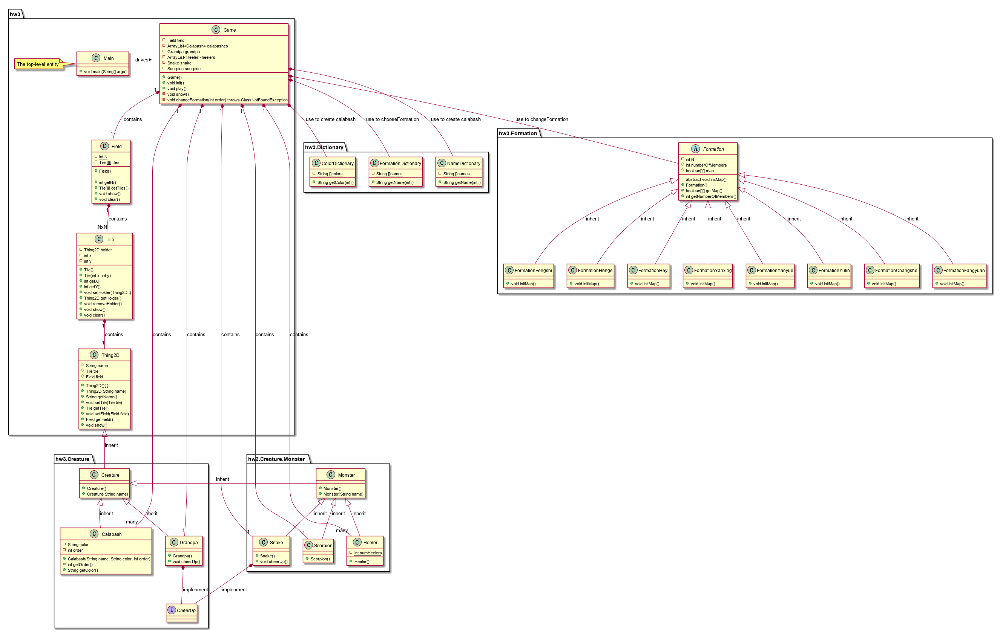

# 版本更新

(重写所有代码)

### 一、程序结构

	

| 包                           |
| ---------------------------- |
| package hw3                  |
| package hw3.Creature         |
| package hw3.Creature.Monster |
| package hw3.Dictionary       |
| package hw3.Formation        |

### 二、类的设计

| 类名                      | 父类            | 功能                                                         |
| ------------------------- | --------------- | ------------------------------------------------------------ |
| class Main                | 无              | 顶层实体，程序入口                                           |
| class Game                | 无              | 游戏整体逻辑实现                                             |
| class Field               | 无              | 战场，包含NxN个Tile                                          |
| class Tile                | 无              | 砖块，每个砖块可以容纳一个Thing2D类型对象                    |
| class Thing2D             | 无              | 二维事物，为生物和非生物的父类                               |
| class Creature            | class Thing2D   | 生物，为葫芦娃、爷爷、妖怪的父类                             |
| class Monster             | class Creature  | 妖怪，为蛇精、蝎子精、小喽啰的父类                           |
| class Calabash            | class Creature  | 葫芦娃，游戏主要角色                                         |
| class Grandpa             | class Creature  | 爷爷，游戏主要角色，能为葫芦娃呐喊助威                       |
| class Snake               | class Monster   | 蛇精，游戏主要角色，能为其它妖怪呐喊助威                     |
| class Scorpion            | class Monster   | 蝎子精，游戏主要角色，妖怪阵营的领头                         |
| class Heeler              | class Monster   | 小喽啰，游戏主要角色                                         |
| class CheerUp             | 无              | 接口，蛇精和爷爷实现该接口，从而可以呐喊助威                 |
| class ColorDictionary     | 无              | 颜色词典，查阅葫芦娃的可取颜色                               |
| class NameDictionary      | 无              | 名字词典，查阅葫芦娃的可取名字                               |
| class FormationDictionary | 无              | 阵型字典，查阅阵型的可取名字                                 |
| class Formation           | 无              | 阵型抽象类，为各种阵型的父类；存储该阵型的图谱map，用来安放Thing2D的位置;与第三次作业相比，可以容纳Creature不同的不同子类对象，实现泛型。 |
| class FormationChangshe   | class Formation | 长蛇阵                                                       |
| class FormationFangyuan   | class Formation | 方圆阵                                                       |
| class FormationFengshi    | class Formation | 锋矢阵                                                       |
| class FormationHenge      | class Formation | 衡轭阵                                                       |
| class FormationHeyi       | class Formation | 鹤翼阵                                                       |
| class FormationYanxing    | class Formation | 雁行阵                                                       |
| class FormationYanyue     | class Formation | 偃月阵                                                       |
| class FormationYulin      | class Formation | 鱼鳞阵                                                       |

### 三、设计思路

1.添加程序入口：程序入口为class Main，通过创建Game对象，调用Game对象提供的方法运行整个游戏。

2.布局：NxN的二维结构(这里N = 12)

​			   Field作为整个战场，包含NxN个砖块，每个砖块Tile可以容纳一个事物Thing2D(实际为Thing2D的子

​			   类，如葫芦娃)

3.运行过程：在Main中创建Game对象，调用init方法进行初始化(生成葫芦娃、爷爷、蛇精、蝎子精和小喽啰)

​					  调用play方法，选择阵型，通过Formation的getMap方法获得阵型图谱，从而设置葫芦娃等的位

​					  置。

### 四、 面向对象的概念、机制、设计理念 

#### 1.封装

数据成员使用private修饰符(对于需要开放给子类的成员使用protected修饰符)，通过get和set方法获得和修改值，防止调用者直接访问数据成员。

#### 2.继承

生物和非生物继承自Thing2D，葫芦娃、爷爷、妖怪等继承生物类，蝎子精、蛇精等则继承妖怪类。通过继承实现代码复用，同时也为多态的使用提供了基础，提高代码灵活度。

#### 3.多态

具体的阵型如长蛇阵等继承抽象类Formation，实现抽象方法 initMap()，从而调用initMap()方法时可以动态绑定到子类的initMap()方法，实现多态。

由于每个Tile可以容纳一个Thing2D及其子类的对象，所以在后续的设计中也可以使用多态。

#### 4.容器

在Game类中，用ArrayList存放葫芦娃们和小喽啰们，可以动态增长，长度不限，更加灵活。

#### 5.泛型

在第三次作业的基础上将Fromation类从只负责提供安放位置改成队伍。存储阵型图谱的同时，可以容纳成员并安放成员的位置

```java
public abstract class Formation {
    private static int N = 12;
    protected int numberOfMembers = 0;
    protected boolean[][] map = new boolean[N][N];
    protected ArrayList<? extends Creature> members;
    protected Creature leader;
    protected Creature cheeuper;
    protected Field field;
	
    //部分方法省略
    public void setTeam(ArrayList<? extends Creature> t){
        members = t;
    }
}
```

通过通配符容纳不同类型的成员(葫芦娃或小喽啰)

#### 6.反射

修改Game类中的play方法和changeFormation方法，原来是通过传入参数int i，通过判断i的值创建具体的Formation子类(如FormationFangyuan)，这里传入类的名称，使用反射机制得到类的构造函数并创建相应类型的对象。

```java
public void play(){
        for(int i = 1; i <= 8; i++){
            String className = FormationDictionary.getName(i);
            try {
                Class<?> FormationClass = Class.forName("hw4.Formation." + className);
                Formation f = (Formation) FormationClass.getDeclaredConstructor().newInstance();

                goodTeam = new FormationChangshe();
                goodTeam.setField(field);
                goodTeam.setTeam(calabashes);
                goodTeam.setCheeuper(grandpa);
                goodTeam.setLeader(null);

                badTeam = f;
                badTeam.setField(field);
                badTeam.setTeam(heelers);
                badTeam.setCheeuper(snake);
                badTeam.setLeader(scorpion);

                changeFormation();
                show();
            }
            catch (ClassNotFoundException | NoSuchMethodException e){
                e.printStackTrace();
            } catch (IllegalAccessException e) {
                e.printStackTrace();
            } catch (InstantiationException e) {
                e.printStackTrace();
            } catch (InvocationTargetException e) {
                e.printStackTrace();
            }
        }
    }
```


### 五、类图



### 六、程序执行

```
cd src
javac -encoding utf-8  hw4/Formation/*.java
javac -encoding utf-8  hw4/Main.java
java hw4/Main
```

