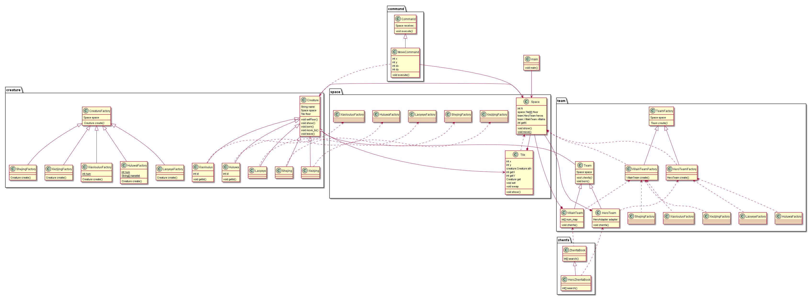

# 171870604 袁满杰 java课程 第四次作业

因为此次作业完成较晚，因此里面顺便参考了设计模式部分的内容，采用了一些设计模式的架构。

首先定义生物类Creature，同时下派葫芦娃、老爷爷、蛇精、蝎子精、小喽啰五个子类继承生物类；其次定义了Team类，以及HeroTeam和VillainTeam两个子类分别对葫芦娃一方和蛇精一方统一管理；整个棋盘Space类只需创建正反派两个队伍类进行高层的操作即可。在对生物和队伍的构建上我采用工厂模式，CreatureFactory和TeamFactory两个抽象类和下面5个生物工厂类和2个队伍工厂类对具体的队伍和生物进行构建。

而队伍本身采用组合模式的思想，继承了ArrayList\<Creature>,利用**泛型**机制便于直接对队伍进行遍历、添加删除等操作。

对于生物的移动，采用命令模式的设计模式，定义了Command模板类和MoveCommand子类，生物要移动时创建实例MoveCommand请求，其中传入其所在空间Space对象的索引，MoveCommand则调用Space的接受函数move，将该生物所在坐标Tile上的内容与目的Tile上的内容进行交换实现生物的移动；

对于阵法，设计了阵法类ZhenfaBook，一个队伍创建时同时实例化阵法书对象，之后在摆阵法时直接查阅该阵法书指挥，在指挥时利用**反射**机制，对队伍内生物进行运行时的类型检查从而分配到不同的阵法位置中；而阵法书本身生成的坐标是对于反派而言的，为了以后扩展使得葫芦娃也可以摆出多种阵型，这里使用了适配器模式，生成了一个HeroZhenfaBook的子类，实际上是作为适配器封装了原有阵法书，将横坐标对折输出从而生成葫芦娃队伍的坐标查阅信息。

总UML类图如下：

最后阵法朝向的参考资料：http://www.360doc.com/content/12/0430/10/865028_207636798.shtml