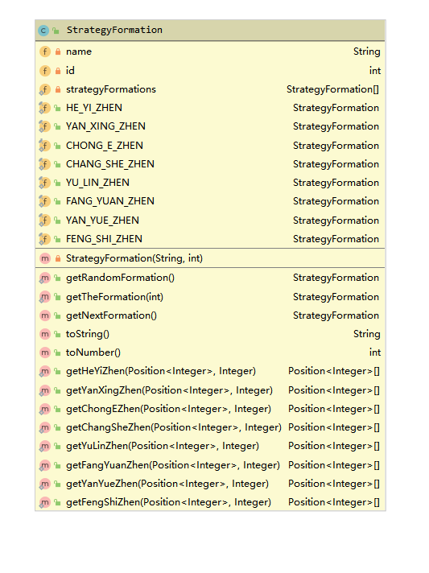

# 一、设计思路  
## （一）需求分析  
### 静态需求：  
（1）存在一个N*N大小的空间，且每个坐标点上可以存在一个生物。  
（2）空间中包括葫芦娃、老爷爷、蛇精、蝎子精以及小喽��若干。  
（3）葫芦娃、老爷爷同蛇精、蝎子精、小喽��站队成对峙局面。  
（4）老爷爷、蝎子精、蛇精位置任意，  
（5）葫芦娃按长蛇阵型乱序站队。  
（6）小喽��按长蛇阵之外的阵型站队。  
### 动作需求：  
（1）需要打印地图上的对峙局面。  
（2）小喽��能够在蝎子精的指挥下变换队形。  
## （二）模块划分与关系  
  主要包含**Main**、**Position(位置，泛型类)**、**Creature（生物）**、**Ground（场地）**、**Grandpa（老爷爷）**、**Scorpion（蝎子精）**、**GourdDoll(葫芦娃)**、**xiaobing（小兵）**、**StrategyFormation（阵型）**九个类。  
  **Position**中记录了生物的位置信息，因为记录生物位置信息的数据根据使用情况的不同，需要不同的数据类型，所以**Position**设计为泛型类，从而灵活面向不同的使用情况。  
  **Ground**中包含有**Creature**的引用数组，用于存储地图上的生物对象；同时生物存在于地图之上，所以生物能够看见整张地图，同时也能使用地图带来的一些操作，因此**Creature**中同样包含**Ground**的引用；**Ground**与**Creature**之间具有相互组合、相互包含关系。  
  老爷爷、葫芦娃、蝎子精和小兵都是生物，都具有生物的属性，所以**Grandpa**、**GourdDoll**、**Scorpion**和**XiaoBing**继承了**Creature**，同时他们又有各自的属性和方法用于完成本次作业的需求。  
  **StrategyFormation**是将由各种阵型组合而成的类，通过调用类中方法，可以获得作业中需要的所有类型；同时考虑到算法种类和数量的不确定性，所以调用阵型构建算法时采用了泛型的设计，从而可以灵活调用需要的阵型。  
# 二、模块描述  
## （一）Position<T extend Number>位置类  
### 属性  
（1）T x， y  
记录了位置的二维坐标  
（2）int path  
用来存放一些其他可能用得到的信息  
### 方法  
（1）getX() getY getPath() setX() setY() setPath()  
获得或者修改类中的属性字段  
（2）toString()  
返回位置信息代表的String字符串  
（3）isEqual()  
对比两个对象的位置信息是否一致  
## （二）Creature生物类  
### 属性  
（1）Position<Integer> position  
  记录生物自身的位置所在。  
（2）String name  
  记录生物的名称（老爷爷、蝎子精、蛇精等）  
（3）Ground ground  
  即整张地图的引用。  
### 方法  
（1）getPosition() toString()  
  依次获得生物的位置坐标、名称的属性。  
（2）changePosition(Position position)  
  直接修改生物的位置属性。  
（3）goSomewhere(int targetx, int targety)  
  尝试修改生物的位置，生物会在地图上试图找到一条到达目的地的路径，路径上不能出现任何生物进行阻挡，如果成功找到这样的路径，生物会进行位置的修改，同时打印经过的路径。  
## （三）Ground场地类  
### 属性  
（1）public static final int GROUND_SIZE  
  地图的大小，因为地图的大小在一开始就是确定的、不会改变的，同时在程序中会被多次使用，所以被设置为static final的常量。  
（2）Creature[][] creatures  
  用于存放并记录生物对象的引用数组。  
（3）Position[][] positions  
  与楼上的creatures具有相对应的存储的内容，主要用于在地图上进行路径的寻找。  
### 方法  
（1）getNewAddress(int left, int righ, int up, int down)  
  获取一个范围，在检查给定范围中是否还有空闲的空间，如果有则在其中随机选取一个空闲位置作为结果返回。*（不会修改地图的属性）*  
（2）checkAddressEmpty(int x, int y)  
  检查给定位置的空间是否是空闲的。  
（3）addCreation( Creature creature)  
  向地图中添加一个生物，即修改creatures和positions两个地图。*（地图中的一切方法都不会有对生物对象的修改）*  
（4）deleteCreation(Creature creature)  
  从地图中删除一个生物，修改creatures和positions两个地图。  
（5）changeAddress(Creature creature, int x, int y )  
  修改地图上记录生物的引用的位置。  
（6）searchPath(Creature creature, int targetx, int targety)  
  在地图上寻找一条路径*（使用广度优先遍历）*，如果成功找到路径，则会记录路径上经过的每一步的顶点*（每步只修改x或y轴坐标之一，且数据值只修改1）*。  
（7）showGround()  
  打印场地上所有生物的布局。  
（8）setGroupStrategyFormation(String group, Creature<T> leader, StrategyFormation strategy, Position<T> position, int members)  
将场地中的指定类型生物按照指定阵型排列布置。其中生物的类型和排列的阵型分别由group和strategy确定，并在运行时通过反射找到具体制定的类型，以及需要调用的阵型方法，因此group和stragety需要是已知的类型和方法名称，否则会抛出错误；而position和members则指定阵型的位置以及组成的总人数。  
## （四）Grandpa老爷爷类  
### 属性  
Creature[] gourds  
  老爷爷需要能管理葫芦娃，所以老爷爷类中会有一个记录葫芦娃的引用数组。  
### 方法  
（1）setGourds()  
  在地图上的随机位置随机地布置葫芦娃。  
（2）setGourdsStrategy(Position position, StrategyFormation strategy)  
  使葫芦娃在地图上按特定阵型在特定位置进行排列，主要是调用Ground提供的阵型设定方法  
## （五）Scorpion蝎子精类  
### 属性  
（1）int louluonum  
  记录一次性设置的小喽��数量。  
（2）int louluoid  
  记录场地上小喽��的最大编号，蝎子精在设置小喽��时用来依次为其命名。  
### 方法   
（1）setLouluonum(int louluonum)  
  设置蝎子精设置小喽��的数量。  
（2）callLouLuo()  
  蝎子精会在场地上定量添加小喽��，小喽��的位置随机确定。  
（3）setLouluoStrategy(Position position, StrategyFormation strategy)  
  指挥场地中的小喽��按特定阵型分布，主要调用Ground中的阵型设置方法。  
## （六）GourdDoll葫芦娃类和XiaoBing小兵类  
  在本次作业中，葫芦娃和小兵没有特殊的方法，但是为了反射中根据类名选择相应的对象，所以分别自Creature继承出各自的类。  
## （七）StrategyFormation阵法类  
  阵法类中存放了八种阵法的构成方法，同时还以枚举的形式设置了对应的八个对象（主要是为了便于记录阵型方法的名称，同时便于测试效果的展示）。阵法构成方法使用统一的参数类型：Position position, Integer members，分别指定阵型的具体位置以及成员数量。  

