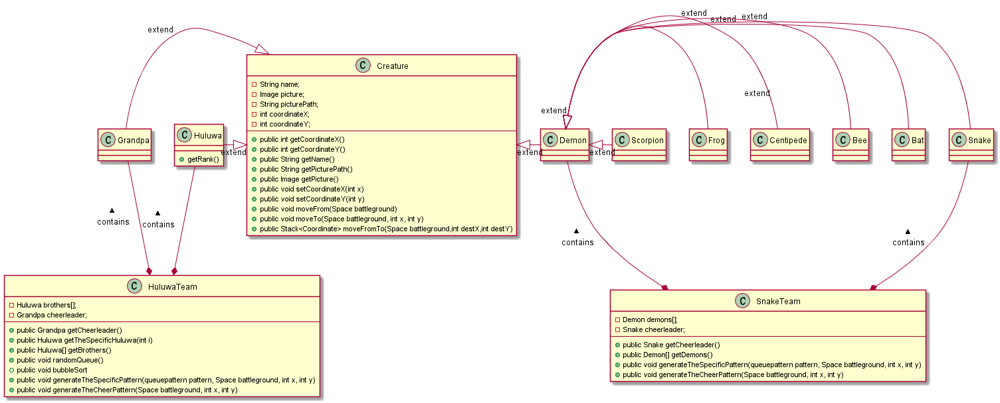
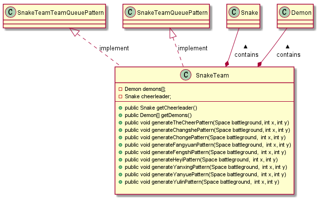
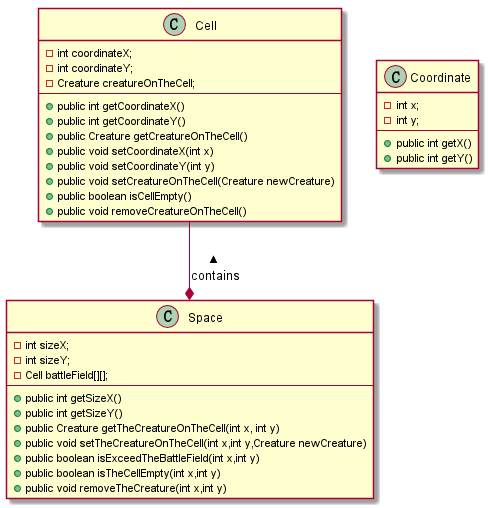
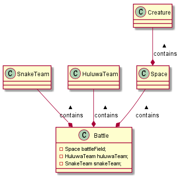
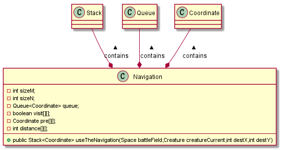
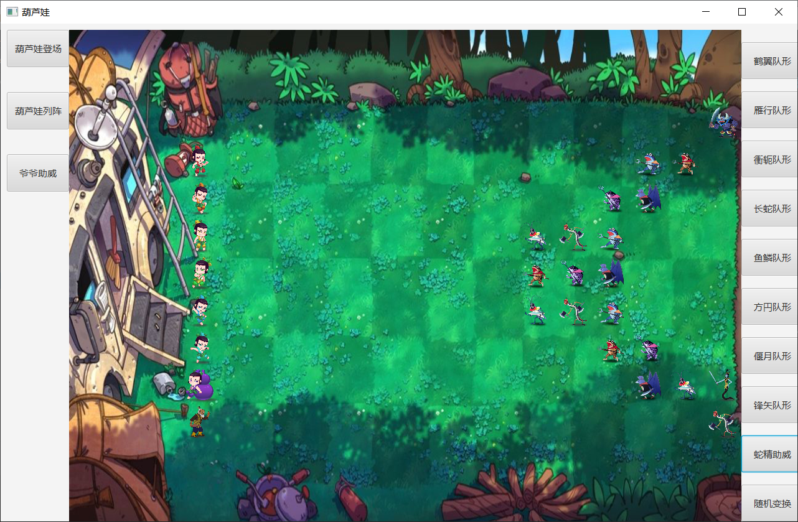

# 作业三：面向葫芦娃编程

## 需求分析

- 实现一个`NxN`的二维空间（`N>10`)，任意一个坐标上可站立一个生物体。
- 让初始乱序的葫芦娃们按照排行顺序排成长蛇形。
- 蝎子精可以带领若干小喽啰排成不同阵型，与葫芦娃们形成对峙局面
- 老爷爷和蛇精放在合适的位置，为各自一方加油助威

## 设计分析

### Package creature

#### Creature类

- 作为最基本的生物体类拥有名称、坐标、图像、图像地址等属性，均为protected。
- 拥有接口可以获得属性或者设置坐标属性
- 拥有方法moveTo和moveFrom，分别可以让物体移动到指定坐标或从当前坐标上消失
- 拥有方法public Stack<Coordinate> moveFromTo(Space battleground,int destX,int destY)获得移动到destX,destY的最短路径

#### Huluwa类

- Creature子类，另外拥有rank排行和color颜色
- 拥有接口可以获得排行

#### Demon类

- Creature子类，在此仅用来归类妖怪，方便以后对妖怪添加方法
- 是Bat/Bee/Centipede/Frog/Scorpion/Snake的不同妖精类的父类

#### Grandpa类

- Creature子类，因为老爷爷不是妖怪也不是葫芦娃，方便以后对老爷爷添加方法

  creatureUML图：

  

#### HuluwaTeam类

- 由葫芦娃数组brothers和啦啦队员老爷爷cheerleader组成

- 拥有接口获得属性

- void randomQueue()对葫芦娃兄弟乱序排列

- void bubbleSort()按照排行排序的方法

- void generateChangshePattern(...)覆盖了排列阵法

- void generateTheCheerPattern(...)设置啦啦队员位置的接口

  HuluwaTeamUML图：

  

#### SnakeTeam类

- 由妖怪数组demons和啦啦队员蛇精cheerleader组成
- 拥有接口获得各属性
- void generateChangshe/Chonge/....（共八种）Pattern(...)覆盖了排列阵法
- void generateTheCheerPattern(...)设置啦啦队员位置的接口

SnakeTeamUML图：



### Package space

#### Cell类

- 表示二维空间内一个方格坐标，拥有横纵坐标属性以及在这个方格上的生物体
- 拥有接口获得和设置各属性
- boolean isCellEmpty()判断该位置是否有生物体
- void removeCreatureOnTheCell()讲方格上的生物体移除

#### Space类

- 表示一个二维空间，拥有长宽属性和方格数组battleField
- 拥有接口获得和设置属性，以及获得和设置方格上的生物体
-  boolean isExceedTheBattleField(...)判断坐标是否超出二维空间
- 拥有方法判断该位置是否为空以及移除方格上的生物体

spaceUML图：



### Package battle

#### battle类

- 拥有battleField二维空间、葫芦娃队和蛇精队属性

battleUML图：



### Package navigation

#### Navigation类

- 导航系统，有需要计算最短路径的各种属性

- public Stack<Coordinate> useTheNavigation(...)用来获取当前生物体移动到目的地点最短路径

  navigationUML图：

  

### Package queuepattern

#### HuluwaTeamQueuePattern 接口

- void generateChangshePattern(Space battleground, int x, int y))用来设置葫芦娃队伍的阵型
- void generateCheerPattern(Space battleground, int x, int y))用来设置老爷爷啦啦队的位置

#### SnakeTeamQueuePattern 接口

- void generateChangshe/Yanxing/...（共8种）Pattern(Space battleground, HuluwaTeam huluwaTeam, int x, int y)用来设置蛇精妖怪队伍的阵型
- void generateCheerPattern(Space battleground, int x, int y))用来设置蛇精啦啦队的位置

## 使用javafx增加GUI

### Main类

- Main继承于javafx的Application类
- 这里使用了Scene builder进行UI的可见化设置。在start函数里通过加载FXML文件进行控件的布局。

```java
public class Main extends Application {

    @Override
    public void start(Stage primaryStage) throws Exception{
        //Timeline timeline=new Timeline();
        //timeline.setCycleCount(Timeline.INDEFINITE);
        //timeline.setAutoReverse(false);
        Parent root = FXMLLoader.load(getClass().getResource("sample.fxml"));
        primaryStage.setTitle("葫芦娃");
        primaryStage.setScene(new Scene(root, 1280, 800));
        primaryStage.show();
        
    }
    
    public static void main(String[] args) {
        launch(args);
    }
}
```

### Controller类

- 在Scene builder的设计里，控件的控制和监听事件注册由Controller类里的函数完成。
- Controller类里包含以下数据成员。battle含有整个对战的生物体以及二维空间。battleBackground是对战的背景图片。depth和width分别是背景的长宽。selectedCreature是当前选中的生物体，用来对应鼠标事件的，timeline是妖怪阵容变化动画的时间线，timelineHuluSort是葫芦娃从乱序到对应位置的动画的时间线。startorEnd用来标记对应妖怪阵容变化按键的开始和停止，currentHuluwaSortDone用来标记葫芦娃走到对应位置后动画的结束。huluSortNum用来记录已排好序的葫芦娃的数量。lastRand用来记录上一个妖怪变化的阵容。path用来存储当前葫芦娃从当前位置到对应位置的具体路径。isHuluwaOnTheSpace记录葫芦娃是否已上场

```java
    private Battle battle;
    private Image battleBackground;
    private int width;
    private int depth;
    private Creature selectedCreature;
    private Timeline timeline;
    private Timeline timelineHuluSort;
    private boolean startOrEnd;
    private boolean currentHuluwaSortDone;
    private int huluSortNum;
    private int lastRand;
    private Stack<Coordinate> path;
    private boolean isHuluwaOnTheSpace;
```

- Controller类里有以下控件。Button用于控制阵营变换阵型。canvas作为画布用于显示对战场面。Label用于显示当前选取的对象的名称。ImageView用于显示当前选择的对象的图片。

```java
    @FXML private Canvas canvas;
    @FXML private ImageView selectedImage;
    @FXML private Label selectedLabel;
    @FXML private Button randomHuluTeam;
    @FXML private Button shexingHuluTeam;
    @FXML private Button heyiDemonTeam;
    @FXML private Button yanxingDemonTeam;
    @FXML private Button chongeDemonTeam;
    @FXML private Button changsheDemonTeam;
    @FXML private Button yulinDemonTeam;
    @FXML private Button fangyuanDemonTeam;
    @FXML private Button yanyueDemonTeam;
    @FXML private Button fengshiDemonTeam;
    @FXML private Button grandpaCheer;
    @FXML private Button snakeCheer;
    @FXML private Button randomChange;
```

## 增加了一点额外功能

### 鼠标选中显示生物体的图片和名字

- 在Controller类里有函数private void canvasOnMouseClicked/private void canvasOnMouseDragged，通过Scene builder注册到了canvas的鼠标点击事件上。当鼠标在画布canvas上点击时，就会通过坐标的换算找到battle类battleField成员对应位置上的生物体，然后显示该生物体的图片和名称。

```java
    @FXML private void canvasOnMouseClicked(MouseEvent event) {
        canvas.setOnMouseClicked(new EventHandler<javafx.scene.input.MouseEvent>() {
            @Override
            public void handle(MouseEvent event) {
                int x=(int)event.getX()-280;
                int y=(int)event.getY();
                //System.out.println("x:"+x+"y:"+y);
                if (x>0&&y>0)
                {
                    x=x/60;
                    y=y/60;
                    if (battle.battleField.getTheCreatureOnTheCell(x,y)!=null){
                        selectedCreature=battle.battleField.getTheCreatureOnTheCell(x,y);
                        selectedImage.setImage(selectedCreature.getPicture());
                        selectedLabel.setText(selectedCreature.getName());
                    }
                }
            }
        });
    }
```

### 拖拽选中的生物体到其他空的地方

- 在Controller类里有函数private void canvasOnMouseDragged(MouseEvent event)，通过坐标的换算找到battle类battleField成员对应位置，看是否有生物体在上面，如果没有就放在上面。

```java
@FXML private void canvasOnMouseDragged(MouseEvent event) {
        canvas.setOnMouseDragged(new EventHandler<javafx.scene.input.MouseEvent>() {
            @Override
            public void handle(MouseEvent event) {
                int x=(int)event.getX()-280;
                int y=(int)event.getY();
                //System.out.println("x:"+x+"y:"+y);
                if (x>0&&y>0)
                {
                    x=x/60;
                    y=y/60;
                    if (selectedCreature!=null&&battle.battleField.isTheCellEmpty(x,y)) {
                        selectedCreature.moveFrom(battle.battleField);
                        selectedCreature.moveTo(battle.battleField,x,y);
                        display();
                    }
                }
            }
        });
    }
```

### 妖怪们每隔0.5s变换一次队形

- 通过按钮randomChange来控制，按一下去开始，再按就结束，用一个boolean类型来标记。用时间线timeline设置动画，生成随机数对应不同队形

```java
        timeline=new Timeline();
        timeline.setCycleCount(Timeline.INDEFINITE);
        timeline.setAutoReverse(false);
        KeyFrame keyFrame = new KeyFrame(Duration.millis(500), new EventHandler<ActionEvent>() {
            @Override
            public void handle(ActionEvent event) {
                int rand = (int) Math.round(Math.random() * 7 + 1);
                while(true){
                    if (rand!=lastRand){
                        break;
                    }
                    else {
                        rand = (int) Math.round(Math.random() * 7 + 1);
                    }
                }
                switch (rand) {
                    case 1:
                        battle.snakeTeam.generateTheSpecificPattern(new HeyiPattern(), battle.battleField, 8, 4);
                        display();
                        break;
                    case 2:
                        battle.snakeTeam.generateTheSpecificPattern(new YanxingPattern(), battle.battleField, 14, 3);
                        display();
                        break;
                    case 3:
                        battle.snakeTeam.generateTheSpecificPattern(new ChongePattern(), battle.battleField, 14, 3);
                        display();
                        break;
                    case 4:
                        battle.snakeTeam.generateTheSpecificPattern(new ChangshePattern(), battle.battleField, 14, 3);
                        display();
                        break;
                    case 5:
                        battle.snakeTeam.generateTheSpecificPattern(new YulinPattern(), battle.battleField, 11, 3);
                        display();
                        break;
                    case 6:
                        battle.snakeTeam.generateTheSpecificPattern(new FangyuanPattern(), battle.battleField, 12, 3);
                        display();
                        break;
                    case 7:
                        battle.snakeTeam.generateTheSpecificPattern(new YanyuePattern(), battle.battleField, 14, 2);
                        display();
                        break;
                    case 8:
                        battle.snakeTeam.generateTheSpecificPattern(new FengshiPattern(), battle.battleField, 11, 3);
                        display();
                        break;
                    default:
                        System.out.println("wrong in random!!!");
                }
                lastRand=rand;
            }
        });
        timeline.getKeyFrames().clear();
        timeline.getKeyFrames().add(keyFrame);
```

## 运行截图



## 面向对象的设计理念

### SRP 单一职责原则

- Creature类中寻找路径的功能通过Navigation类实现，寻路与Creature类的功能实现分离。

### OCP 开放封闭原则

- 将变换阵型变成接口queuePattern，然后具体的阵型implement这个接口，具体实现来获得不同的阵型。保证了接口的统一，便于阵型的添加和调用。

### LSP LISKOV替换法则

- 所有从Creature类继承的子类HuluWa、Demon、Grandpa、Snake和Scorpion都可以替换程序中的Creature类。

### ISP 接口隔离原则

- 在葫芦娃游戏的代码设计中，没有出现一个类拥有其功能所不需要的方法。

### CARP 合成/聚合复用原则

- 二维空间类TwoDimensionSpace是有一组Tile类合成而来。
- 战场类BattleField类由Creature的子类和TwoDimensionSpace类聚合而成。

## 反射机制应用

​	导入creature下的配置文件obj.properties，利用反射机制，对snakeTeam中的18个小怪创建对象。一共有7种不同的小怪：Scorpion、BlueFrog、BrownFrog、PurpleFrog、Bat、Bee、Centipede，根据配置文件决定生成哪些不同的小怪。

```java
    public SnakeTeam()throws Exception{
        demons=new Demon[19];
        Properties prop = new Properties();
      prop.load(Creature.class.getClassLoader().getResourceAsStream("creature/obj.properties"));
        int num=18;
        for (int i=0;i<=num;i++){
            String number=i+"";
            String name="Demon"+number;
            String demon="creature."+(String)prop.get(name);
            demons[i]=(Demon)Class.forName(demon).newInstance();
        }
        cheerleader=new Snake();
    }
```

## 泛型机制应用

对于每一个二维空间的小格Cell上，运用泛型机制，上面可以站不同的Creature。

```java
public class Cell <T extends Creature>{
    private int coordinateX;
    private int coordinateY;
    private T creatureOnTheCell;
...
}
```

