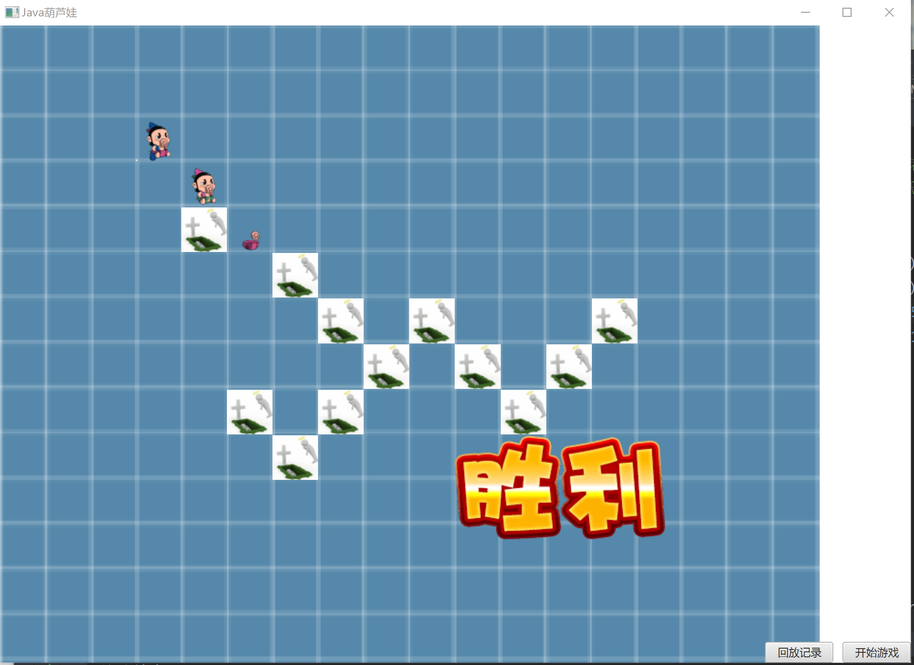

# java作业：葫芦娃大战妖精

### 游戏功能说明
1. 运行程序
	主界面显示游戏背景图, 右下角有两个按钮, 分别是回放记录与开始游戏, 对应的快捷键分别是'L'和'空格'.
	背景图是一个简单的网格图, 也是战场, 使用网格图可以清楚看见每个游戏生物的位置.

2. 开始游戏
	按下空格键或者对应按钮开始游戏.
	首先弹出对话框选择本次游戏的存储路径并点击确定按钮, 若点击取消按钮则本局游戏不会被存储.
	游戏开始时, 战斗双方以指定的阵列队形在两侧战队, 葫芦娃在左侧, 妖怪在右侧.
	葫芦娃阵营包括七个葫芦娃和老爷爷; 妖怪阵营包括蛇精, 蝎子精, 六个小喽啰.
	之后战斗双方寻找自己身边的敌人, 并沿着最短路向敌人移动; 若没有发现敌人, 则进行随即移动.移动方向是上下左右四个方向.
	当对立阵营双方相邻时, 向对方发动攻击. 血量为0的生物死亡, 留下死亡图片, 并且在原地留下实体, 阻止其他生物移动至此位置.
	当某一阵营的生物体全部死亡后, 游戏结束.
	游戏结束时, 若葫芦娃阵营有生物存活, 显示胜利的图片, 否则显示失败的图片.

3. 回放记录
	按下L键或者对应按钮回访记录.
	首先弹出对话框选择回放记录的存储文件(*.txt), 点击确定按钮确认存储文件, 点击取消按钮取消回放记录.
	之后重现被存储的一场战斗.

---

### 游戏内容展示
1. 游戏主界面

2. 点击开始游戏按钮, 选择存储路径

3. 游戏运行过程中

4. 游戏结束

5.点击回放记录按钮, 选择游戏存档

---

### 项目代码结构

##### 代码文件主要包括:

代码文件|定义的类
-|-
Main.java | class Main;
Controller.java | class Controller;
God.java | class God;
Creature.java | class Creature; class ImageTranslation; class ImageToDead; class Road; class Node;
Boy.java | class Boy;
Grandpa.java | class Grandpa;
Enemy.java | class Enemy;
World.java | class World;
Formation.java | class Formation;

##### 类的功能说明
1. class Main
	包含函数start和mian, start函数是运行图形界面的入口, main是程序运行的入口.
2. class Controller
	是GUI的控制类, 开始游戏和回放记录的入口函数都在此类中定义.
	1. 主要数据成员是一个BorderPane.
	2. 主要方法包括 : 

方法|功能
-|-
initPane|设置背景图片, 添加按钮.
gameStart|调用God类方法生成生物, 并按阵型摆放.
gameRun|定义线程池, 运行每个生物对应的线程.
replay|读取存档文件, 创建动画还原游戏过程.

3. class God
	God类中所有的方法和数据都是静态的, God类用于产生和调度生物, 以及监控生物状态.
	主要的方法包括 : 

方法|功能
-|-
makeFormation|将存储在一个ArrayList中的生物按照指定阵型和位置摆放在地图上.
getCreatures|输入多个生物的name, 据此创建生物, 返回ArratList类型.

4. class Creature
	用于描述生物属性和行为的类. 

数据属性|代码定义
-|-
姓名|tring name;
坐标|int x, y;
血量|int HP;
伤害|int damage;
存活状态|boolean alive;
所属阵营|int camp;
生物对应的图像|ImageView creatureIMG;
视野|int eyesight;
地图|World world;
GUI窗口|BorderPane pane;

方法|功能
-|-
run|多线程所需, 重写Runnable类的run接口.
action|定义生物的整体行为; 内容是 : 若生物体血量为0或更低, 更新生物状态为死亡;死亡的生物不会有任何动作, 其线程结束.存活的生物若是中立生物, 则随机移动.否则寻找敌人, 向敌人移动或者攻击, 未发现敌人则随机移动.			
findEnemy|寻找敌人, 返回下一步将要达到位置的坐标, 返回值是(-1, -1)则代表未发现敌人或敌人不可达.
attack|对敌人发动攻击, 扣除敌人相当于自身攻击数值的血量.
walk|修改生物的坐标, 修改world.map, 修改图像的显示位置, 创建动画并使用Platform.runlater执行.
randomWalk|使用随机数确定坐标, 再调用walk函数移动至目标位置.
die|修改存活状态, 将生物的图片修改为死亡后的图片.

5. class Boy; class Grandpa; class Enemy;
	这三个类是class Creature的子类, 在各自构造函数中修改class Creature的数据成员, 以达到产生不同属性值的生物的效果.

6. class Formation
	Formation类针对每个阵型定义相应的static方法, 除此以外没有其他成员.
	方法的参数都是ArrayList<Creature> creatures, int x, int y;
	(x,y)对应阵型上一点, 以此为起点可以用相对位置描述整个阵型.
	
7. class World
    数据成员包括Creature[N][N] map和N.
	map是外界可以访问的数据, 这样设计的原因是World用于描述地图, 是没有生命的, 所以其数据成员可以由其他类进行修改.
	
---

### 用到的编程方法
1. 封装
	将生物抽象为一个类, 为其定义数据成员代表生物的属性, 定义方法代表生物的行为. 将生物作为一个整体, 而不是将其分割成若干个属性值.
2. 继承
	葫芦娃 老爷爷 妖怪都是生物, 故class Boy class Grandpa class Enemy都是继承的 calss Creature.
3. 多态
	map虽然是一个Creature类型的数组, 但是它可以存储Boy Grandpa Enemy类的引用.
4. 多线程
	将游戏中的每一个生物都作为一个线程, 在Creature类中实现run接口, 实现生物的并发活动.
5. 异常处理机制
	使用try catch的方法捕捉可能存在的异常.
6. 单元测试
	为class Creature的方法和class Road的寻找最短路的方法编写测试用例.
	
---

### UML类图
！[UML类图](FinalWork/src/main/resources/plantuml/plantuml.png "类图")
