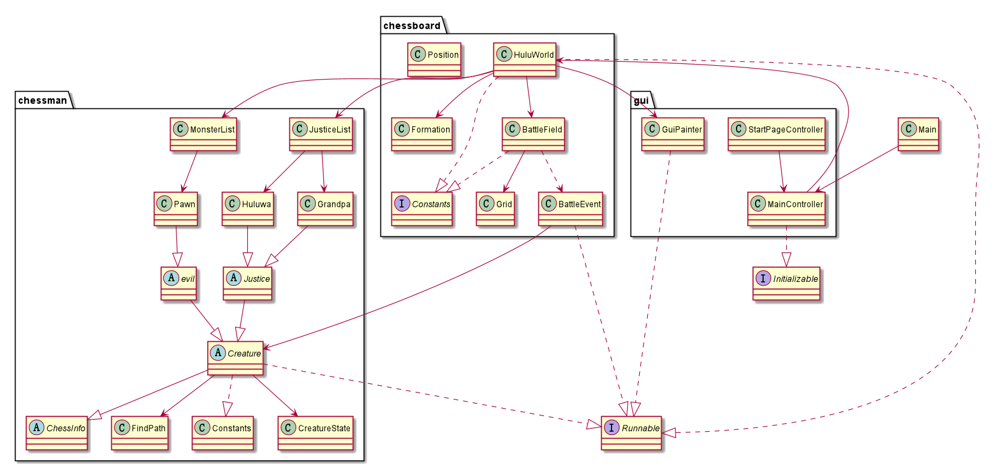
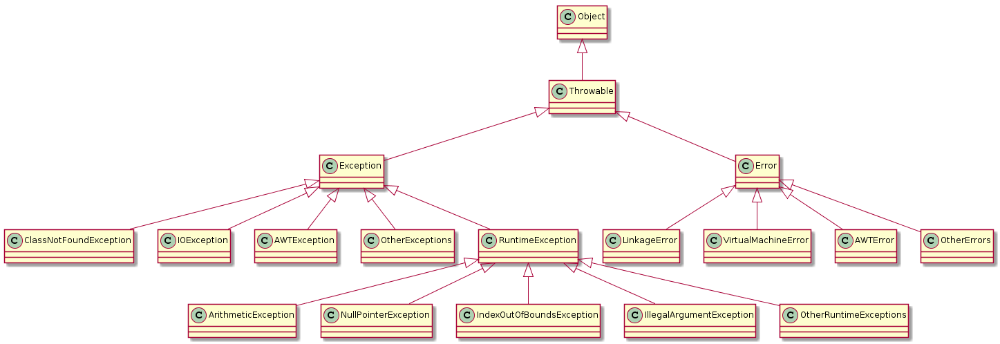
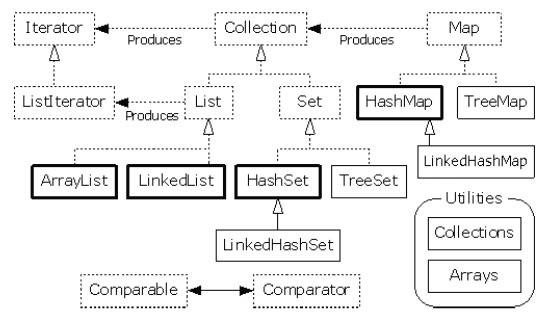

# 葫芦大战妖精

## 目录

[TOC]

## 前言

又是一年年关将至，在洞里蹲了一年的妖精们又来爷爷家冲业绩啦，且看葫芦娃们将如何发挥自己的才能，保护自己与爷爷的家园吧：

大娃力大无穷，可以对妖精造成极大攻击，不过行动速度会有所延迟；

拥有千里眼的二娃是文职情报人员，因此拥有较低的攻击力，但是喜欢打游击，行进速度非常快；

三娃刀枪不入，拥有最高的血量；

四娃、五娃水系火系攻击之下，拥有较为平均的攻击力与速度；

六娃隐身刺客，擅长奇袭，拥有较快的行进速度；

七娃是法师，读条长因此走得慢；


## UML 一览




## 模块划分

### package chessman

* 这个包里面是棋盘上可以行动的生物集合；

* 对外接口类

  * Justice：这是一个抽象类，抽象了在棋盘上战斗的正义的一方；包含了从`abstract class Creature`中继承来的生物信息；并且实现了`interface Runnable`的`run()`，它代表了生物线程的生命周期；在此可以认为，生命就是运动，正义的一方活着就决定自己走不走，若遇到敌人就杀了它，`2s`之内扬了敌人的骨灰（指敌人变成幽灵之后在战场继续存在两秒后消失），当然，它自己若被杀了，也是`2s`之内扬了自己的骨灰；
  * Evil：这是一个抽象类，抽象了在棋盘上战斗的邪恶的一方；与`class Justice`一样的规范；
  * MonsterList：这是一个初始化信息存储类，负责对所有Evil类对象初始化，并提供给外部调用者；本次存储了蝎子精、蛇精、喽啰的信息；
  * JusticeList：这是一个初始化信息存储类，负责对所有Justice类对象初始化，并提供给外部调用者；本次存储了葫芦娃、爷爷的信息；

* 内部使用类

  * Creature：这是一个抽象类，拓展了`interface Runnable`，但真正重写`Run()`将会在其子类中；包含了从`interface ChessInfo`继承来的非生物性属性信息，以及自身的生物性属性信息，如武力值等，由此也知道自己将会在哪一个战场上活动，当然，无论是在它自身还是它的子类中，它都无权直接修改战场记录的它的位置，只能向战场发出移动位置请求；在这个抽象类中，仅仅定义了对这些属性的访问方法与修改方法；
  * CreatureState：这是一个枚举类，定义了生物的三种状态：进击中、对战中、去世了；
  * Grandpa，Huluwa，Pawn：爷爷、葫芦娃、反派，假如有特殊功能比如回血，将会Override`abstract class Creature`的`run()`；

  

### package chessboard

* 这个包里面是战场及其相关的类；

* 对外接口类：
  * HuluWorld：拥有并将分配所有的生物线程、战斗处理线程、图形界面显示线程，掌控这些线程的生杀大权，其自身也作为一个线程运行；拥有战场上所有生物支配权；在战斗开始之前的阶段，能作为中介，通过`class Formation`向`class BattlePlace`传递`class Creature`的初始队列位置信息、由`class BattlePlace`负责将生物放到战场棋盘的响应位置；当战争开始之后，它启动拥有的所有生物线程，让它们自己在战场上跑动；
* 内部使用类：
  * BattleEvent：负责处理两个生物之间的流血冲突事件，按照概率决定正义还是邪恶胜利，并进行减血、设置生物状态；
  * BattleField：是一个N*M的矩形棋盘战场，每一格上可以战立一个生物；k可以就收生物移动请求，并允许生物在战场上移动；其中的`guiDisplay`方法将在`class GuiPainter `中按一定时间间隔调用，在这个方法中，将会根据N\*M的矩阵棋盘上的生物信息，计算在画布上对应位置，并将其画出，在这里认为每一次打印都是在绘制动画的关键帧，将据此记录关键帧并实现重放功能；
  * Formation：保存各个阵型的关键坐标，并作为中介向`class BattlePlace`传递`class Creature`的初始位置设置请求；
  * Grid：是N\*M的矩阵棋盘上的一格，保存了一个生物的信息；
  * Position：保存了N\*M的矩阵棋盘上的一个坐标信息(x, y)；


### package gui

* 这个包总体负责图形界面的显示；

* 外部接口类：
  * MainController：提供按键、进行信号发送，即依照指令实现初始界面到游戏界面的跳转，并在游戏界面选择战场生物初始化阵型、使之开始战斗、重放战斗；
* 内部使用类
  * GuiPainter：作为一个线程实现，仅仅为关键帧刷新提供服务；拥有一个战场类对象，能隔一段时间间隔向其发送刷新关键帧的请求，由战场在画布上更新生物图片的位置；
  * StartPageController：提供初始界面的显示，能够处理初始界面到游戏界面的跳转信号；


## 设计原则

### SRP (The Single-Responsibility Principle) 单一职责原则  

* *A class  should have only one reason to change.*
* `class BattleEvent`当且仅当正义的伙伴与反派相遇发生战斗时，负责胜负裁判与执行；
* `class Creature`当且仅当生物信息发生变化时，负责信息访问或修改信息；
* `class MonsterList`当切仅当`class BattleEvent`初始化棋盘上活动生物时提供初始化生物服务；
* `class GuiPainter`当且仅当需要刷新战场图形显示的时间点，才起刷新作用；


### OCP (The Open-Closed Principle) 开放-封闭原则

* *Software entities (classes, modules, functions, etc.) should be open for extension, but closed for modification.*  
* `class BattleEvent`依赖`abstract class justice`的规约，这个抽象类可以被子类`class Huluwa`与`class Grandpa`拓展新的接口，但是不同它们的实现可以不同而不需要改变彼此，也无需让外部调用者为此做出改变

### LSP (The Liskov Substitution Principle) Liskov替换原则

* *Subtypes must be substitutable for their base types.*
* 对于`package chessman`以外的对象来说，它们只需要知道`abstract class Creature`制定的规范，不需要知道具体生物有哪几种

### ISP (The Interface-Segregation Principle) 接口隔离原则

* *Deals with the disadvantage of “fat” interfaces – whose interfaces are not cohesive*
* 在原先的设计中，有`class GameMaster`既要负责生物运动位置的决策、又要负责对地图存储的生物位置信息变更进行维护；有`class BattleField`既要负责维护单元格信息、又要负责生物路径规划、还要负责对战斗事件的处理，是两个非常丑陋的胖类，在最终的设计中，将`class GameMaster`拆分为`class HuluWorld`并依赖新的`class BattleField`，将原先的`class BattleField`的战斗事件处理分解成为`class BattleEvent`，使其依赖`class BattleEvent`提供的接口，但不用自身去实现；


### DIP (The Dependency-Inversion Principle) 依赖倒置原则

*  *High level modules should not depend on low-level modules. Both should depend on abstractions.*
*   `class BattleEvent`依赖`abstract class justice`的规约，而非规约的实现类，即实现了`Hollywood Principle`的*an inversion of interface ownership*需求;


## 封装

不妨来看`class Justice`的`run`函数，其中体现了`class BattleField`的封装方法`boolean existBadCreature(int x, int y)`，与自身的封装方法`void setCreatureOnNextPosition(Position nextPos)`，这样的封装使得整段代码提高了叙事能力，读代码仿佛讲故事，一个正义的伙伴生命不息运动不止、脚步不停反派迫害不停的历程就展现在眼前：

```java
public void run() {
        while(!isKilled) {
            //only one creature can visit filed each time
            synchronized (field) {
                //take a step forward
                if(state == CreatureState.RUNNING) {
                    // bad creatures ahead, start battle
                    if (field.existBadCreature(position.getX(), position.getY()+1)) {
                        Creature monster = field.getCreature(position.getX(), position.getY()+1);
                        if(monster.getState() == CreatureState.RUNNING ) {
                            //only field can change creature, avoid creature do things to creature
                            field.createBattleEvent(this, monster);
                        } else {
                            //go to nextPos, and clear curPos info
                            setCreatureOnNextPosition(getNextPosition());
                        }
                    } else {
                        //go ahead directly
                        setCreatureOnNextPosition(getNextPosition());
                    }
                }
            }
            if (state == CreatureState.DEAD) {
                try {
                    TimeUnit.SECONDS.sleep(2);
                    synchronized (field) {
                        //disappear from the field, not to block others, after dead stay a short time to tell user sb. die
                        field.clearCreature(position.getX(), position.getY());
                    }
                } catch (InterruptedException e) {
                    e.printStackTrace();
                }
                isKilled = true;
            }
            try {
                //different creature have different speed to go ahead
                TimeUnit.MILLISECONDS.sleep(((Huluwa)this).getSpeed());
            } catch (InterruptedException e) {
                e.printStackTrace();
            }
        }
    }
```


## 继承

根据CARP(Composition/Aggregation Reuse Principle) 合成/聚合复用原则，在设计中尽可能避免了继承，可以看到整个框架中只有`package chessman`中的生物进行了继承；

## 多态

对BattleEvent来说，无论传递给它的是Justice子类还是Evil子类，它都只看到它们的Creature特征，也即其位置信息修改与访问字段，用子类初始化超类，只用自己需要的接口：

```java
public BattleEvent(Creature cala, Creature mons) {
        this.cala = cala;
        this.mons = mons;
        cala.setState(CreatureState.INBATTLE);
        mons.setState(CreatureState.INBATTLE);
    }
```


## 多进程同步

以class GuiPainter的run为例，全局共享资源是战场棋盘上的位置、以及生物自身，但是由于一个生物只能通过战场BattleField向另一个生物发起战斗求，因此实际我们只要将进入战场棋盘视为进入临界区，对此进行同步即可，回到UML图，观察所有依赖BattleField的类，对其中访问BattleField的块进行同步，即可达成共享资源合理利用，也即不能同时杀死一个生物、两个生物不能同时站在一个格子上：

```java
public void run() {
        System.out.println("guiPainter is running");
        frameInfos = new ArrayList<>();
        while (!isKilled) {
            synchronized (battleField) {
                drawBattleField();
            }
            try {
                //refresh the gui every 100 ms
                TimeUnit.MILLISECONDS.sleep(100);
            } catch (InterruptedException e) {
                e.printStackTrace();
            }
        }

        System.out.println("gui线程退出");
    }
```


## 异常处理

Java中的异常分类：

* `Syntax errors` arise because the rules of the language have not been followed. They are detected by the compiler.
* `Runtime errors` occur while the program is running if the environment detects an operation that is impossible to carry out.
* `Logic errors` occur when a program doesn't perform the way it was intended to.




在本次设计中，由于使用了`sleep`函数和文件输出，因此我们需要自行识别`InterruptedException`与`IOException`，并对其进行处理，在此追踪异常传递的路径方便调试：

```java
try {
                    TimeUnit.SECONDS.sleep(2);
                    synchronized (field) {
                    //disappear from the field, not to block others, after dead stay a short time to tell user sb. die
                        field.clearCreature(position.getX(), position.getY());
                    }
                } catch (InterruptedException e) {
                    e.printStackTrace();
}
```

```java
try {
            fout = new BufferedWriter(new FileWriter(file));
        } catch (IOException e) {
            e.printStackTrace();
        }
```


## 集合类型

需要注意的是，虚线框都是`abstract`类，在实现`class FindPath`可到达判断的算法时曾经想要使用`queue`，结果发现必须用它的实现类初始化才可以使用，因此实际使用中，初始化一定用实现类，如`Vector`、`ArrayList`、etc..

其更多综合应用在下面的泛型中




在`class JusticeList`中，使用了`abstract class List`，并用其实现类`class ArrayList`初始化

```java
 public List<Justice> HuluCollection = new ArrayList<Justice>();
```


## 泛型

曾经在`class Grid`中实验参数类的通配符与擦除，通过`T extends Creature`使得可以在`isBlock`中调用`Creature`的方法，同时Java泛型的实现方式就是将类型参数用边界类型替换，在下面的例子中就是把`T`用`Creature`替换。这种实现方式看上去就像是把具体的类型（葫芦娃、妖精），擦除到了边界类型（它们的父类`Creature`)：

```java
public class Grid <T extends Creature>{
    private Creature x;

    public Grid() {
        x = null;
    }

    public boolean isEmpty() {
        return (x == null);
    }

    public Creature get() {
        return x;
    }

    public void clear() {
        x = null;
    }

    public void set(T x) {
        this.x = x;
    }

    public boolean isBlock() {
        return (x == null) || (x.getState() == State.DEAD);
    }
}
```

上面是在类定义的时候引入通配符，在使用类定义时没有边界类型的参数类时，做了下面实现：

```java
public void setBattlePlace(BattleField field,ArrayList<? extends Creature>hululist,ArrayList<? extends Creature>monsterlist){
        //put the evil and justice onto battleField
        int i = 0;
        for(Creature creature:monsterlist){
            creature.setPosition(i+1,11);
            field.setCreatrue(creature,1+i,11);
            i++;
        }
        i = 0 ;

        for(Creature creature:hululist){
            creature.setPosition(list[i].getX()-1,list[i].getY()+2);
            field.setCreatrue(creature,list[i].getX()-1,list[i].getY()+2);
            i++;
        }
    }
```

可能会向`ArrayList<? extends Creature> hululist`传入`ArrayList<Justice>`的参数，可以由下面的例子看到，使用了`extends`的`hululist`不能存入任何元素，但是没有关系，`setBattlePlace`中巧妙地避免了这一个问题，因为棋盘上的生物始终是固定不变的，我们只需要通过`foreach`访问`hululist`中的`creature`引用，并不需要再增加或减少生物的个数：

```java
class Fruit{}
class Apple extends Fruit{}
public class GenericsAndCovariance {
    public static void main(String[] args){
    Plate<? extends Fruit> p=new Plate<Apple>(new Apple());
    
        //不能存入任何元素
        p.set(new Fruit());    //Error
        p.set(new Apple());    //Error
        //读取出来的东西只能存放在Fruit或它的基类里。
        Fruit newFruit1=p.get();
        Object newFruit2=p.get();
        Apple newFruit3=p.get();    //Error
    }
}
```

```java
public static void main(String[] args) {
        Computer<SSD> computer = new Computer<SSD>(new SSD());
        SSD disk = computer.getDisk(); // No cast needed
        //computer.setDisk(new HHD()); // error!
        computer.setDisk(new SSD());

        Computer<HHD> computer_ = new Computer<HHD>(new HHD());
        HHD disk_ = computer_.getDisk(); // No cast needed
        computer_.setDisk(new HHD());

        Computer<? extends Disk> a =  new Computer<HHD>(new HHD());
        //a.setDisk(new HHD());//error
        //HHD aa=a.getDisk();//error
        Disk aaa=a.getDisk();

```


##  输入输出

将关键帧`class FrameInfo`写入Record文件：	

```java
public void saveGameLog(File file) throws Exception {
        BufferedWriter fout = null;
        try {
            fout = new BufferedWriter(new FileWriter(file));
        } catch (IOException e) {
            e.printStackTrace();
        }
        ArrayList<FrameInfo> frameInfos = guiPainter.getFrameInfos();
        fout.write(frameInfos.size()+"\n");
        for (int i = 0; i < frameInfos.size(); i++) {
            int creatureInfoNum = frameInfos.get(i).creatureInfos.size();
            fout.write(creatureInfoNum+"\n");
            for (CreatureInfo creatureInfo : frameInfos.get(i).creatureInfos) {
                fout.write(creatureInfo.toString());
            }
        }
        fout.write(battleResult+"\n");
        fout.flush();
        fout.close();
    }
```

## 使用指南

按空格开始游戏，也可以按按钮开始；

Restart键可以中断战斗；

阵型键可以调整葫芦娃的排兵布阵；


## 最终效果


## 反思总结

* 时间安排极不合理，来不及写复盘模块、学习maven；
* 前期设计没有考虑最后的实验，也没有及时优化，造成大作业与前期作业断代式迭代更新设计；
* 没有善用GitHub的git管理，导致中途出现了写了比较致命的代码而无法回退；
* 大项目的框架设计流程非常不成熟，节奏与整体把控非常之差；
* 没有实现棋盘格与背景图格子的对齐、也没有实现人物移动的丝滑特效，使得图形界面上人物的移动仿佛闪现，追着人物看是可以看出来它是有一格格动的；


