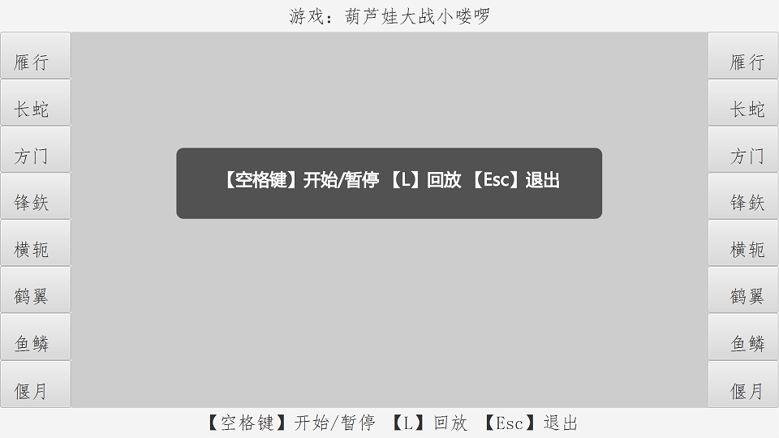
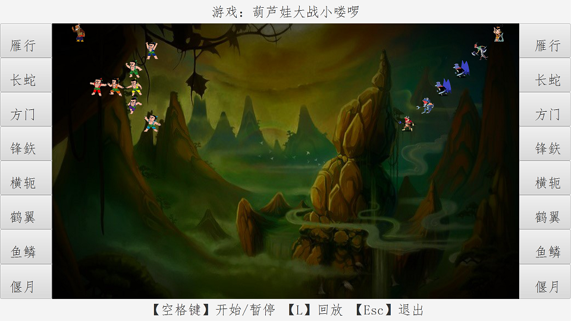
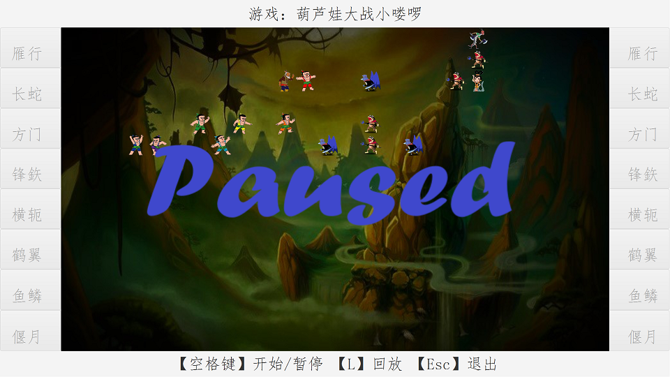
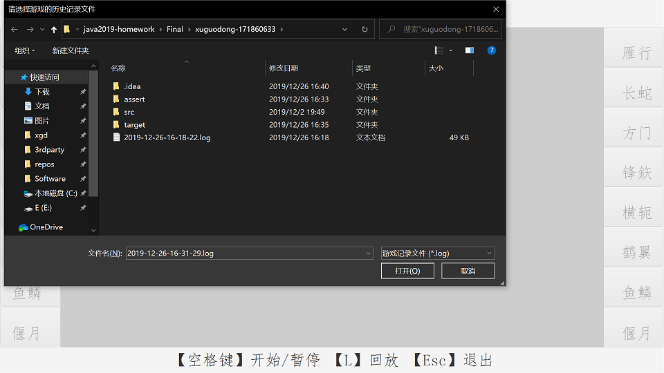
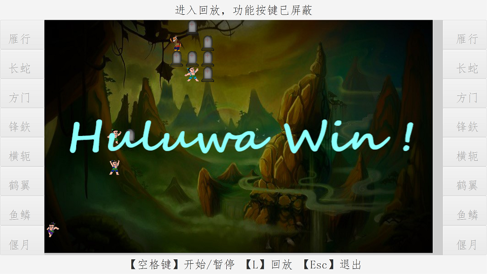
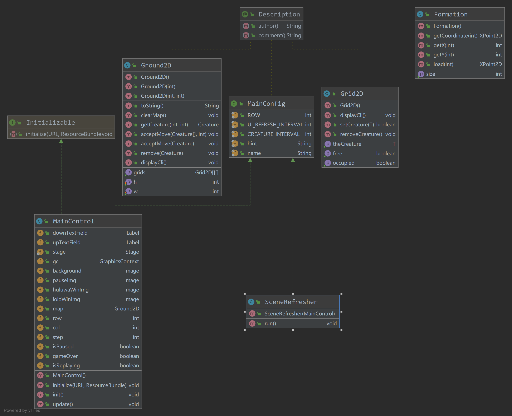
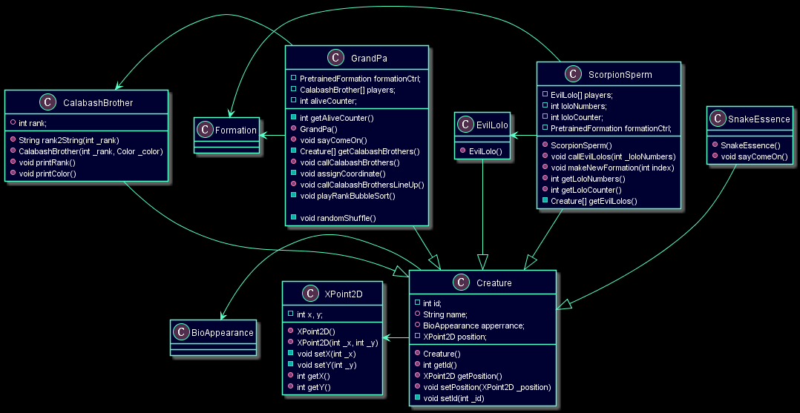

# Java-2019 大作业 葫芦娃大战妖精
  
## 171860633 徐国栋  

## 游戏简介

玩家通过按钮设置葫芦娃和妖精的初始阵型，游戏中，葫芦娃和妖精自行接敌，相遇的双方，死亡率五五开，战斗过程自动存为日志，通过选择log文件回放游戏过程

## 操作说明

1. 编译：在当前目录（包含pom.xml文件）下执行命令：
```
mvn clean test package
```

2. 运行：target目录下有jar文件，执行命令：
```
java -jar target/Java2019Final-1.0-SNAPSHOT.jar
```

3. 进入游戏，自动全屏，初始界面：



4. 点击左侧按钮选择葫芦娃阵型，点击右侧按钮选择敌方阵型



5. 按下空格，游戏开始（如果没有选择阵型，则双方随机初始化一个阵型），此时通过空格键控制暂停和继续



6. 游戏记录自动以时间为文件名保存到当前目录，按下L，选择.log文件以回放



6. 一次游戏结束或回放结束，会显示胜利方：



7. 系统要求：回放日志【2019-12-26-16-18-22.log】要求桌面长宽比 > 3:2，新游戏对分辨率无特殊要求

## 设计思路

### 概述

设计场地类Ground2D描述全局状态；设计生物类Creature控制人物行为，生物类实现移动、攻击、被击败等方法，并且单独实现为一个线程，在被击败前，通过Ground2D观察场地和其它人物的状态，移动并攻击敌人；设计主控类MainControl，维护人物队列；设计UI刷新类SceneRefresher，以1000/24帧每秒的速度刷新UI，具体做法是，获取主控类的人物列表，调用每个Creature的show方法，把Creature持有的自身图像画到Canvas上面；设计记录类Record，用三个整型数描述一帧里一个人物的状态，用序列化的方法存入文件供回放。

### 人物外观的模拟

人物拥有皮肤，表现为渲染需要的图片，为向左和向右移动的人物设置不同的图片
```java
public class BioAppearance {
    public Image img,left,right;
    ...
}
```

### 生物的模拟

采用**派生**的方式描述不同生物，编写生物类为基类，记录共有的信息。生物类是核心，对于里面的具体方法，

* 1、移动函数实现了通过地图进行横纵向观察，如有敌人，定向冲锋。为了在双长蛇阵对峙时营造混乱气氛，即使葫芦娃看到敌人，也有1/5的概率乱跑。攻击函数是在Ground2D**加锁**的情况下进行的，防止地图出现幻读

* 2、攻击函数实现了敌我判断，以50%的概率决定敌我双方生死，攻击时为生物类**加锁**，防止两方同时调用攻击函数导致的行为不一致现象

```java
public class Creature implements Runnable, MainConfig { 
    ...
    public static MainControl ctrl;
    public void show(){
        ...
        ctrl.gc.drawImage(getImage(),x,y,w,w);
    }
    public void move(){... }
    public boolean attack(Creature target){...}
    private void fight(){...}
    public boolean goon(){
        synchronized (Map.class) {
            ...
            if (allowMove())   move();
            else               fight();// 在这里调用attack函数
            ...
        }
    }
    @Override public void run() {
        while(true){
            if(ctrl.gameOver || !isAlive)  break;          
            else if(!ctrl.isPaused)        goon();
            try 
                TimeUnit.MILLISECONDS.sleep(MainConfig.CREATURE_INTERVAL);
            catch (Exception e){;}
        }
    }
}
```

对于葫芦娃，拥有特有的家族排行，同时编写两个映射函数获取家族排行和颜色的中文名用于展示
```java
final class CalabashBrother extends Creature {
    public int rank; 
     public String rank2String(int _rank) {...}
     public String color2String() {...}
    ...
}
```

对于老爷爷和蝎子精，让他们做阵型的创造者，设置老爷爷类、蝎子精类，**继承**生物类，包含阵型类的实例，(class GrandPa)(class ScorpionSperm)和(class PretrainedFormation)是**聚合**关系；老爷爷类包含7个葫芦娃类实例，蝎子精类包含可动态调整数量的小喽啰类实例，老爷爷和蝎子精通过阵型类生成的坐标，告诉手下应该待在什么位置
```java
final class GrandPa extends Creature {
    private PretrainedFormation formationCtrl;
    private CalabashBrother[] players;
    ...
    public void sayComeOn() {... }
    public void callCalabashBrothers() {...}
    ...
    public void callCalabashBrothersLineUp() {...}
    ...
    private void playRankBubbleSort() {...}
    private void randomShuffle() {...}
}
final class ScorpionSperm extends Creature {
    EvilLolo[] players;
    private PretrainedFormation formationCtrl;
    ...
    public void callEvilLolos(int _loloNumbers) {...}
    public void makeNewFormation(int index) {...}
    ...
}
```

### 阵型的模拟

设置阵型类，需要记录8种阵型的归一化坐标，通过load函数返回阵型占用的尺寸
```java
public class Formation {
    private ArrayList<XPoint2D> minimizedExpansion;
    ...
    // 加载阵型 1-7:特殊阵型，其它:长蛇阵，返回阵型占用的尺寸
    public XPoint2D load(int i) {...}
    private XPoint2D loadHeyi() {...}
    ...
}
```

### 场地的模拟

设置格子类，生物站在格子Grid2D上，若干格子构成地图Ground2D。这里的格子类Grid2D使用了泛型，即Grid2D\<T extends Creature\>，地面Ground2D类包含Grid2D类组成的二维数组作为人物位置，通过setCreature(T newCreature)方法将喽啰、葫芦娃、蝎子精等生物布置到地面位置。地面Ground2D类起到了向Creature类提供信息而导航的作用
```java
public class Grid2D<T extends Creature> {
    private boolean occupied = false;
    ...
    T theCreature;
}
class Ground2D {
    private int w, h;
    ...
    private Grid2D[][] grids;
    public Grid2D[][] getGrids(){...}
    private void allocMap() {...}
    public void clearMap() {...}
    public Creature getCreature(int x, int y){...}
    ...
    public void displayCli() {...}
}

```

### JavaFx的运用

在使用JavaFx的事件监听和Canvas画板的过程中遇到过以下问题。

* 1、无法在处理键盘事件的函数里刷新UI界面

* 2、无法在initialize函数中获得fxml文件里预定义的控件的长宽

为了解决问题一，把界面刷新和主控分离，把界面刷新类SceneRefresher单独实现为一个线程，在gameOver之前，以1000/24帧每秒的速度刷新Canvas。为了消除问题二带来的不良影响，Canvas初始化被延迟到第一次按空格键或者点击按钮选择阵型的时候，因为Canvas需要根据全屏尺寸来初始化。下面是SceneRefresher的具体实现，其中，mainControler.update()函数是在把所有的Creature画到界面上，为了防止刷新时，部分人物移动导致的画面重合，对Creature加锁，这样刷新的一定是最新的数据

```java
public class SceneRefresher implements Runnable,MainConfig {
    private MainControl mainControler;
    ...
    @Override
    public void run() {
        while(true){
            try {
                synchronized (Creature.class) {
                    mainControler.update();
                }
                TimeUnit.MILLISECONDS.sleep(MainConfig.UI_REFRESH_INTERVAL);
                ...
            }
            ...
        }
    }
}

```

### 记录日志

通过记录每一帧人物的位置来记录日志，如果直接在刷新UI的时候把Creature给**序列化**，导致的问题是图片和一些辅助变量占用过多存储空间，为此设计Record类，把每一帧每个人物的存储压缩到3个整型数，用type表示图片索引，x、y表示人物的位置

```java
public class Record implements Serializable {
    private int type;
    public int x,y;    //  每一帧只记录这3个数
    static Image[]a=new Image[30];
    private static final long serialVersionUID = -3286564461647015367L;
    ...
}
```

## 知识点运用汇总

### 工厂模式

按照工厂模式生成葫芦娃和小喽啰，CalabashBrotherFactory可以看作老爷爷的花园
```java
interface CreatureFactory<T> {
    T create(int rank, Color color);
}
class CalabashBrotherFactory implements CreatureFactory<CalabashBrother> {...}
class EvilLoloFactory implements CreatureFactory<EvilLolo>{...}
```

### 异常处理

除了sleep函数和UI框架要求的异常处理外，还有通过异常机制，在读文件时，判断日志的结尾的运用：
```java
try{
    re=(Record)reader.readObject();
    group.add(re);
}catch (EOFException e){
    isEnd=true;
    break;
}
```

### 集合类型

使用ArrayList来存放记录项、进行打乱等
```java
public class RecordPlayer implements Runnable, MainConfig {
    private ArrayList<ArrayList<Record>> records;
    ...
}
private void randomShuffle() {
    ArrayList<CalabashBrother> randList = new ArrayList<>(Arrays.asList(players));
    Collections.shuffle(randList);
    players = randList.toArray(players);
}
```

### 泛型

将Grid2D实现为泛型，Ground2D类持有Grid2D的二维数组来为生物类提供临近格子是否被占用的导航信息
```java
public class Grid2D<T extends Creature> {
    private boolean occupied = false;
    ...
    T theCreature;
}
```

### 注解

实现Description接口，对大作业新增的类进行描述
```java
@Target(ElementType.TYPE)
@Retention(RetentionPolicy.SOURCE)
public @interface Description {
    public String author() default "徐国栋";
    public String comment() default "注释说明类的用途";
}
```

### 输入输出

* 1、通过对Record类的序列化和反序列化，来记录每一帧上人物的行为
```java
public class Record implements Serializable {
    ...
    private static final long serialVersionUID = -3286564461647015367L;
    private void writeObject(ObjectOutputStream stream) throws IOException {
        stream.defaultWriteObject();
    }
    private void readObject(ObjectInputStream stream) throws IOException, ClassNotFoundException {
        stream.defaultReadObject();
    }
}
```

* 2、通过文件流读写日志
```java
ObjectOutputStream writer = new ObjectOutputStream(new BufferedOutputStream(new FileOutputStream(file)));
Record tmp=new Record(i);
writer.writeObject(tmp);
...
ObjectInputStream reader = new ObjectInputStream(new BufferedInputStream(new FileInputStream(file)));
int countCreature = reader.readInt();
Record re =(Record)reader.readObject();
```

### 单元测试

预置阵型采用手工输入坐标的方式编写代码，通过单元测试验证预置阵型的高度不会超过配置文件规定的画布高度
```java
public class BorderTest implements MainConfig {
    @Test public void testBorderSafety(){
        ...
        assertEquals(lessThan(size.getY()+1, MainConfig.ROW),true);
    }
}
```

### UML
```java
public class MainControl implements Initializable , MainConfig {...}
```

```java
public class Creature implements Runnable, MainConfig {...}
```


# END