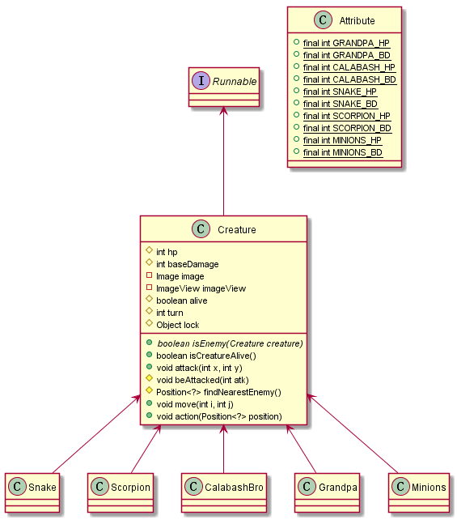
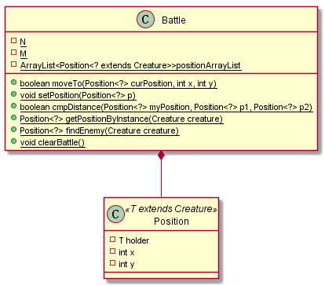
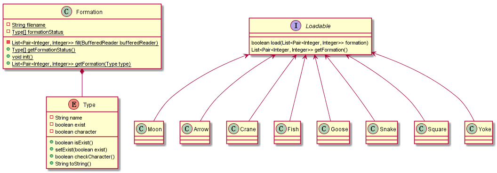
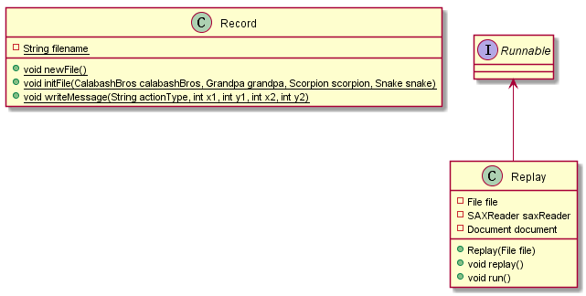

# 葫芦娃大战妖精
本程序展示了葫芦娃与妖精战斗的过程，并支持存档和读档。

## 程序运行
程序入口为`Main`类，并有背景音乐。  
  
点击**开始游戏**后，弹出游戏主界面。按下空格，游戏开始。其中，阵型是随机选择的。  
  
在游戏未开始或者结束时，可以点击上面的**文件**菜单中的打开选项，选择存档(.xml)文件，可以进行战斗回放。  

## 总体框架
  
  

## 主要类
### 生物  
  
所有生物都有一个共同的基类`Creature`。因为不同的生物都有类似的行为和属性，其相同点都在基类中实现。  
`Creature`实现了`Runnable`接口，表示一个生物体是一个线程。其中的`run`方法由子类重写，因为`Grandpa`和`Snake`类并不参与战斗。  
`Attribute`类描述了各个生物体的生命值(HP)和攻击力(BD)，主要是方便修改人物属性。  
`Creature`类方法作用解释：  
+ isEnemy()：抽象方法，判断某生物体是否为本身的敌人  
+ isCreatureAlive():判断生物体是否还活着
+ attack(int x, int y):向坐标(x, y)的生物体进行攻击
+ beAttacked:被攻击
+ findNearestEnemy():找到最近的敌人的位置(曼哈顿距离最短)
+ move(int i, int j):人物图像移动  
+ action(position):采取行动，position为本身的位置  

运行过程:创建一个生物，调用重写后的`run`方法，该生物体调用`findNearestEnemy()`方法找最近的敌人。若该敌人在其上下左右四个方位，则攻击，否则则向其移动。若无法移动，则重新随机选择一个方位进行移动，重复N次后若仍无法移动则跳过该线程。 

### 战场  
  
`Battle`类为战场类，描述一个以`Position`为单元的二维平面，其中`holder`表示一个生物体，`x`和`y`为坐标。  
`Battle`类中的`N`和`M`表示其长和宽，`positionArrayList`为"战场"。  
部分方法介绍:  
+ cmpDistance():比较两个敌人与本体的曼哈顿距离的大小，从而选择最近的敌人。  
+ setPosition():设置生物体站在哪个位置
+ moveTo():生物体移动
+ getPositionByInstance:由于生物体本身没有位置信息，因此需要进行搜索
+ clearBattle():清空二维平面  

### 阵型类  
  
每个阵型为一个单独的类，在枚举类型`Type`中有一个变量与之对应，并且继承了`Loadable`接口。这样做的好处是增加阵型时只要增加新的类，并重写接口方法和在`Type`类中增加新的变量即可，减少了对代码的修改量。  
运行流程为:从配置文件中读取阵型信息，利用JAVA**反射**机制来填充对应的阵型类。   

`Formation`类:  
+ `init()`:利用放射从配置文件中加载类信息，初始化阵型类。使用配置文件初始化的初衷是为了方便修改阵型，否则需要对代码进行修改(据说实际开发中类似的信息也是通过配置文件设置)
+ `getFormation()`:返回调用者相应的阵型位置信息
+ `getFormationStatus()`:返回阵型信息数组

`Loadable`接口有两个方法:  
+ `load()`:从文件中加载阵型信息并填充相应的类
+ `getFormation()`:根据请求加载阵型中的位置信息  
这个接口也标记了这个类属于一种阵型。  

`Type`枚举类型有3个变量：  
+ `name`:阵型中文名  
+ `exist`:阵型是否被成功加载
+ `character`:阵型是否适用于葫芦娃(因为某些阵型所需要的生物体个数不足7个)  

### 存档与回放
  
存档文件的格式为**.xml**文件，这样的好处是方便利用现有的工具进行格式化读取和写入，不易出错。  

存档类`Record`以当前系统时间为文件名建立存档文件。  
方法介绍:  
+ `newFile()`:创建新的存档文件
+ `initFile()`:初始化文件，内容为各个生物体的初始坐标信息，血量及攻击力(考虑到血量和攻击力可以被修改)
+ `WriteMessage`:写信息，`actionType`分为`Move`和`Attack`，对应于`Creature`类中的两个函数。  

回放类`Replay`实现了`Runnable`接口，通过读取文件进行复盘。  
方法介绍:  
+ `replay()`：回放的主方法，读取文件信息，由`run()`调用
+ `run()`:重写`Runnable`接口中的方法，调用`replay()`实现回放功能。  

## 多线程
考虑到资源争抢问题和访问顺序问题，通过`Creature`类中的`turn`信息和`Object`类的对象`lock`对临界区资源进行上锁和依次访问。代码如下:  
``` java

while (!Fight.isEnd()){ //判断是否结束(某一方全部死亡)
    synchronized (lock){
        if (turn == Fight.getNowTurn()){    //判断是否轮到自己
            if (alive){
                Position<?> position = Battle.getPositionByInstance(this);
                assert position != null;
                action(position);
            }
            Fight.addNowTurn();
            lock.notifyAll();
            if (alive){
                try {
                    Thread.sleep(500);
                } catch (InterruptedException e) {
                    e.printStackTrace();
                }
            }
        }else {
            try {
                lock.wait();
            } catch (InterruptedException e) {
                e.printStackTrace();
            }
        }
    }
}
```  

## GUI
通过`Controller`类和`fxml`文件，实现用户界面和应用程序逻辑代码分离。其中`Controller`类为控件时间的处理逻辑，`fxml`为UI界面的简单设计。  

## 涉及到的JAVA机制和设计原则
+ 反射  
读取阵型配置文件，通过反射机制自动填充相应的阵型类，减少了对现有代码的修改，符合开放封闭原则。

+ 泛型  
`Position`类通过泛型实现，符合里氏替换原则。  

+ 集合类型  
`Battle`类中的二维平面就是用`ArrayList`类实现，因为其支持泛型。  

+ 单一职责原则   
每一个类都只负责一个功能。  

+ 最少知识原则  
只与你的直接朋友交流，如攻击时，生物体通过询问`Battle`自己最近的敌人在哪来进行决策，而不是自己直接访问`Position`类。实际上，生物体的所有行动都是通过`Battle`来实现，只依赖于这个类。

## 单元测试  
有两个单元测试:  
+ `FormationTest`:测试阵型配置文件是否被成功载入  
+ `BattleTest`:测试是否能够按阵型正确的进行站位(加入GUI后无法测试成功，因为构造函数中涉及javafx控件(ImageView))  
