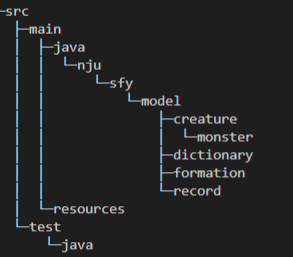
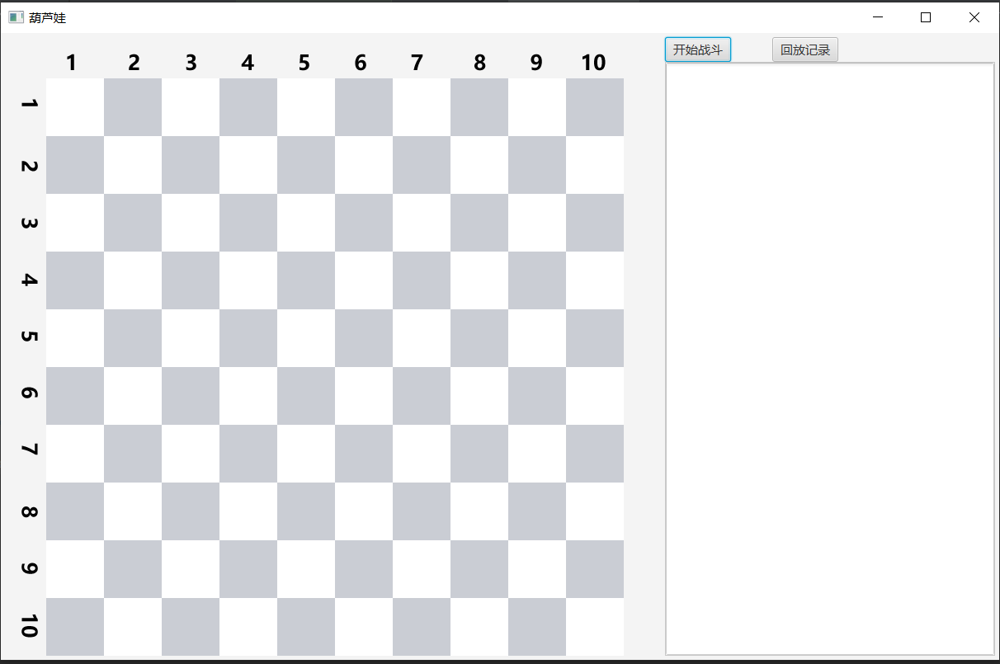
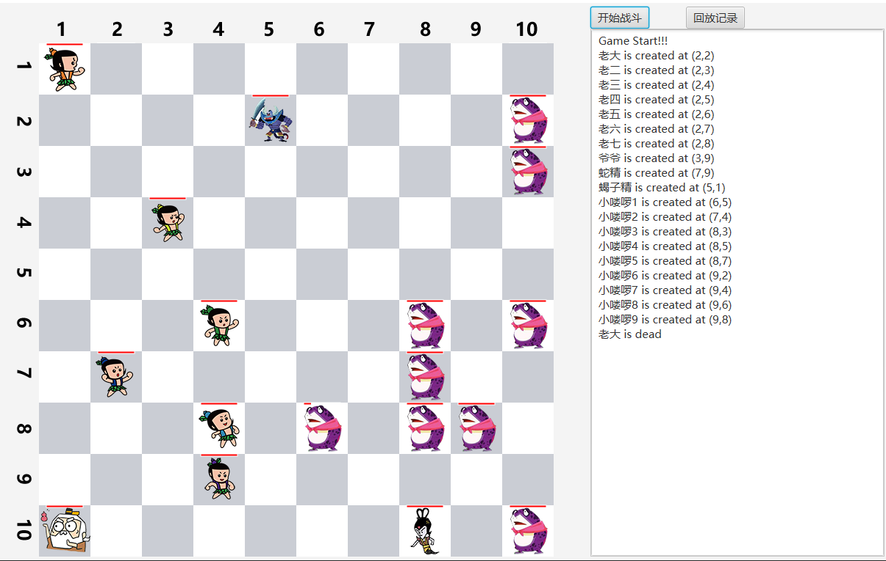
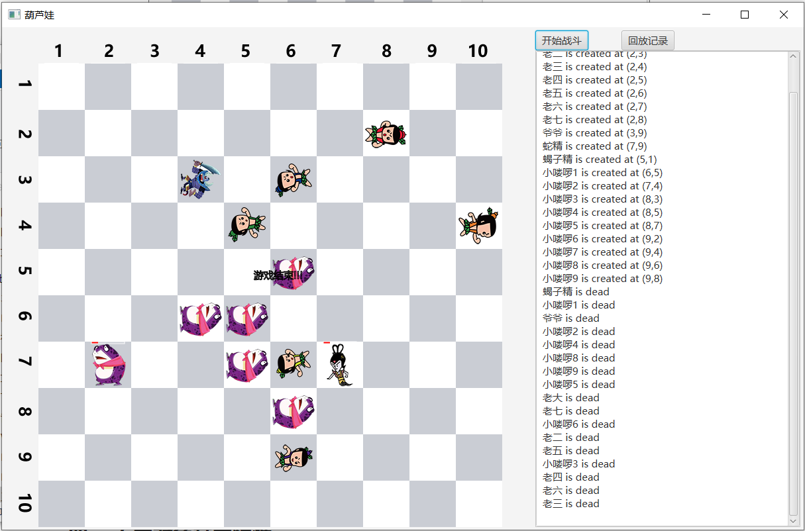
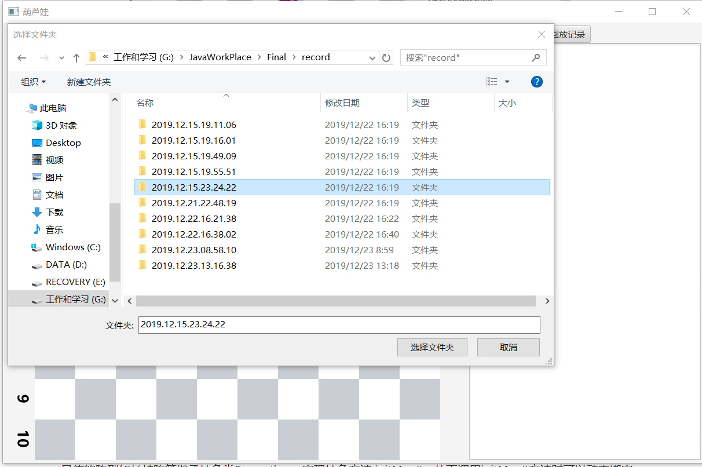
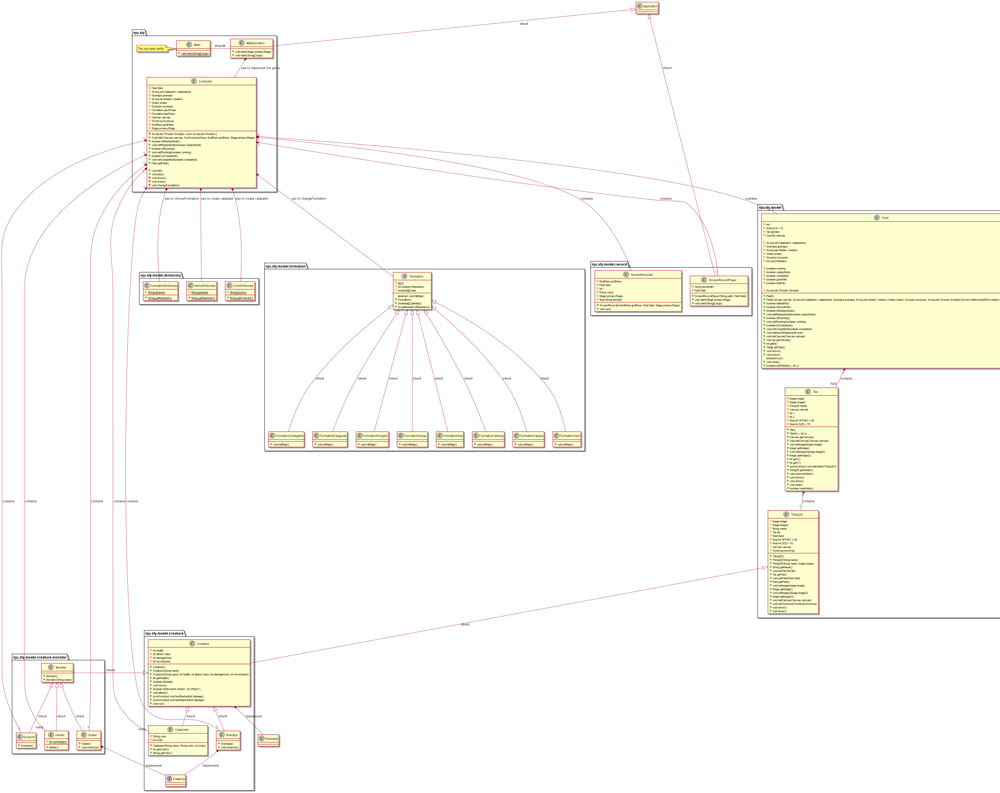

# JAVA大作业：葫芦娃游戏

​																																					171860530

​																																						石丰源

### 一、程序结构

	

| 包                                     |
| -------------------------------------- |
| package nju.sfy                        |
| package nju.sfy.model.formation        |
| package nju.sfy.model.dictionary       |
| package nju.sfy.model.creature         |
| package nju.sfy.model.creature.monster |
| package nju.sfy.model.record           |

### 二、类的设计

| 类名                      | 父类                                  | 功能                                                         |
| ------------------------- | ------------------------------------- | ------------------------------------------------------------ |
| class Main                | 无                                    | 顶层实体，程序入口                                           |
| class Field               | 无                                    | 战场，包含NxN个Tile                                          |
| class Tile                | 无                                    | 砖块，每个砖块可以容纳一个Thing2D类型对象                    |
| class Thing2D             | 无                                    | 二维事物，为生物和非生物的父类                               |
| class Creature            | 继承class Thing2D ，实现 Runnable接口 | 生物，为葫芦娃、爷爷、妖怪的父类                             |
| class Monster             | class Creature                        | 妖怪，为蛇精、蝎子精、小喽啰的父类                           |
| class Calabash            | class Creature                        | 葫芦娃，游戏主要角色                                         |
| class Grandpa             | class Creature                        | 爷爷，游戏主要角色，能为葫芦娃呐喊助威                       |
| class Snake               | class Monster                         | 蛇精，游戏主要角色，能为其它妖怪呐喊助威                     |
| class Scorpion            | class Monster                         | 蝎子精，游戏主要角色，妖怪阵营的领头                         |
| class Heeler              | class Monster                         | 小喽啰，游戏主要角色                                         |
| class CheerUp             | 无                                    | 接口，蛇精和爷爷实现该接口，从而可以呐喊助威                 |
| class ColorDictionary     | 无                                    | 颜色词典，查阅葫芦娃的可取颜色                               |
| class NameDictionary      | 无                                    | 名字词典，查阅葫芦娃的可取名字                               |
| class FormationDictionary | 无                                    | 阵型字典，查阅阵型的可取名字                                 |
| class Formation           | 无                                    | 阵型抽象类，为各种阵型的父类；存储该阵型的图谱map，用来安放Thing2D的位置;与第三次作业相比，可以容纳Creature不同的不同子类对象，实现泛型。 |
| class FormationChangshe   | class Formation                       | 长蛇阵                                                       |
| class FormationFangyuan   | class Formation                       | 方圆阵                                                       |
| class FormationFengshi    | class Formation                       | 锋矢阵                                                       |
| class FormationHenge      | class Formation                       | 衡轭阵                                                       |
| class FormationHeyi       | class Formation                       | 鹤翼阵                                                       |
| class FormationYanxing    | class Formation                       | 雁行阵                                                       |
| class FormationYanyue     | class Formation                       | 偃月阵                                                       |
| class FormationYulin      | class Formation                       | 鱼鳞阵                                                       |
| class ScreenRecorder      | 无父类，实现Runnable接口              | 记录保存                                                     |
| class ScreenRecordPlayer  | class Application                     | 记录回放                                                     |
| class MyApplication       | class Application                     | 程序主界面                                                   |
| class Controller          | 无                                    | 控制器，负责交互和游戏运行                                   |

### 三、运行过程

1.添加程序入口：程序入口为class Main，通过创建MyApplication对象启动应用程序，打开界面。

​							在MyApplication的start函数对界面进行初始化，通过Controller对象控制程序运行。

2.布局：左侧为NxN的二维结构(这里N = 10)，即主战场；右侧为按钮和输出信息。

​			   Field作为整个战场，包含NxN个砖块，每个砖块Tile可以容纳一个事物Thing2D(实际为Thing2D的子

​			   类，如葫芦娃)

​			  通过点击界面右侧的按钮开始战斗或回放记录；当创建游戏生物或者生物死亡时在文本框中输出相应信			  息。

3.运行过程：启动程序后点击开始战斗按钮进行战斗，并同时保存记录；

​					  战斗开始前或者战斗结束后可以点击回放记录按钮选择回放记录并进行回放。

初始界面：



点击开始战斗，各线程启动，线程开始：



游戏结束：



回放记录：点击回放按钮，选择记录所在的文件夹



#### 最精彩的战斗：存放在record文件夹下的2019.12.23.14.14.57文件夹中

前期葫芦娃们抱团逐个击破单兵前来的妖怪、爷爷去右下角偷袭，取得了巨大优势，最后只剩一只怪物被围殴。葫芦娃获得胜利。

### 四、 面向对象基本特性

#### 1.封装

数据成员使用private修饰符(对于需要开放给子类的成员使用protected修饰符)，通过get和set方法获得和修改值，防止调用者直接访问数据成员。

#### 2.继承

生物和非生物继承自Thing2D，葫芦娃、爷爷、妖怪等继承生物类，蝎子精、蛇精等则继承妖怪类。通过继承实现代码复用，同时也为多态的使用提供了基础，提高代码灵活度。

#### 3.多态

具体的阵型如长蛇阵等继承抽象类Formation，实现抽象方法 initMap()，从而调用initMap()方法时可以动态绑定到子类的initMap()方法，实现多态。

由于每个Tile可以容纳一个Thing2D及其子类的对象，所以在后续的设计中也可以使用多态。

### 五、面向对象机制

#### 1.容器

在Controller类中，用ArrayList存放葫芦娃们和小喽啰们，可以动态增长，长度不限，更加灵活。

#### 2.泛型

在第三次作业的基础上将Formation类从只负责提供安放位置改成队伍。存储阵型图谱的同时，可以容纳成员并安放成员的位置

```java
public abstract class Formation {
    private static int N = 10;
    protected int numberOfMembers = 0;
    protected boolean[][] map = new boolean[N][N];
    protected ArrayList<? extends Creature> members;
    protected Creature leader;
    protected Creature cheeuper;
    protected Field field;
	
    //部分方法省略
    public void setTeam(ArrayList<? extends Creature> t){
        members = t;
    }
}
```

通过通配符容纳不同类型的成员(葫芦娃或小喽啰)

#### 3.反射

修改Controller中的init方法，原来是通过传入参数int i，通过判断i的值创建具体的Formation子类(如FormationYulin)，这里传入类的名称，使用反射机制得到类的构造函数并创建相应类型的对象。

```java
String className = "FormationYulin";
Class<?> FormationClass = Class.forName("nju.sfy.model.formation." + className);
            Formation f = (Formation) FormationClass.getDeclaredConstructor().newInstance();

            goodTeam = new FormationChangshe();
            goodTeam.setField(field);
            goodTeam.setTeam(calabashes);
            goodTeam.setCheeuper(grandpa);
            goodTeam.setLeader(null);

            badTeam = f;
            badTeam.setField(field);
            badTeam.setTeam(heelers);
            badTeam.setCheeuper(snake);
            badTeam.setLeader(scorpion);

            field.setNumOfHeelers(badTeam.getNumberOfMembers());
            changeFormation();
```

#### 4.异常处理

以其中一处为例：在装载class FormationYulin，可能找不到该类，所以需要捕捉ClassNotFoundException；在调用FormationClass.getDeclaredConstructor()可能不存在该方法，所以需要捕捉NoSuchMethodException；捕捉后打印异常信息，帮助debug

```java
String className = "FormationYulin";
        try {
            Class<?> FormationClass = Class.forName("nju.sfy.model.formation." + className);
            Formation f = (Formation) FormationClass.getDeclaredConstructor().newInstance();

            goodTeam = new FormationChangshe();
            goodTeam.setField(field);
            goodTeam.setTeam(calabashes);
            goodTeam.setCheeuper(grandpa);
            goodTeam.setLeader(null);

            badTeam = f;
            badTeam.setField(field);
            badTeam.setTeam(heelers);
            badTeam.setCheeuper(snake);
            badTeam.setLeader(scorpion);

            field.setNumOfHeelers(badTeam.getNumberOfMembers());
            changeFormation();
        }
        catch (ClassNotFoundException | NoSuchMethodException e){
            e.printStackTrace();
        } catch (IllegalAccessException e) {
            e.printStackTrace();
        } catch (InstantiationException e) {
            e.printStackTrace();
        } catch (InvocationTargetException e) {
            e.printStackTrace();
        }
```

#### 5.输入输出

在回放记录时需要读取记录，此处用到Java 的I/O机制

```java
try {
                File file = new File(storeDir + File.separator+i+".png");
                if(!file.exists()){
                    field.setReplayMode(false);
                    return ;
                }
                Image image = new Image(file.toURI().toURL().toString());
                canvas.getGraphicsContext2D().drawImage(image, 0, 0);

                i = i + 1;
                Thread.sleep(1000);

            } catch (Exception e) {
                e.printStackTrace();
            }
```

#### 6.注解

(1)overide注解：标注重写父类的某个方法

如在public class MyApplication extends Application中需要重写Application的start方法

```java
@Override
    public void start(Stage primaryStage){
        ...
    }
```

(2)test注解：用于测试

```java
    @Test
    public void testMove(){
		...
    }

    @Test
    public void testDead(){
		....
    }
```

#### 7.多线程

为了防止多线程过程中不同生物进入同一砖块，在生物移动检查要移动的砖块是否有其他生物时，对field上锁，防止其他生物访问

```java
synchronized (field){
            if(field.isInField(x, y) && !field.getTiles()[x][y].hasHolder()){
                if(!field.getTiles()[x][y].hasHolder()){
                    field.getTiles()[x][y].setHolder(this);
                    tile.removeHolder();
                    tile = field.getTiles()[x][y];
                    return true;
                }
                else
                    return false;
            }
            else{
                return false;
            }
        }
```

为了防止一个生物被两个敌人同时击倒，需要对beAttacked方法加上synchronized限制

```java
public synchronized void beAttacked(int damage){
        health -= damage;
        if(health <= 0){
            textArea.appendText(name + " is dead\n");
            tile.setImage2(image2);
            tile.removeHolder();
            tile.draw();
            tile = null;
        }
    }
```

#### 8.回放设计

通过图片流进行记录的保存和回放。

实现 class ScreenRecorder，该类实现了Runnable接口，单独开一个线程用于截屏。

实现ScreenRecordPlayer，创建一个窗口，播放图片。

#### 9.测试

(1)测试生物的移动函数，测试生物原来位置上是否包含该生物(不应该包含)、新移动的位置是否包含该生物(应该包含)

(2)测试生物的被攻击函数，测试生物死亡后所在砖块是否删除该生物，该生物也不再任何砖块上。

具体地，将爷爷随机安放一个位置，随意移动，测试(1)

​				将爷爷随机安放一个位置，受到攻击死亡，测试(2)

```java
 @Test
    public void testMove(){

        Field field = new Field();
        Tile tiles[][] = field.getTiles();
        int N = tiles.length;

        //初始化战场，每个砖块上无holder
        for(int i = 0; i < N; i++){
            for(int j = 0; j < N; j++){
                assertTrue(tiles[i][j].getHolder() == null);
            }
        }

        //将爷爷设置在任意位置，随机向周围移动，检测移动后原砖块是否不再包含爷爷，目标砖块是否包含爷爷
        //共测试10000次
        Grandpa grandpa = new Grandpa();
        grandpa.setField(field);
        Random random = new Random();

        for(int i = 0; i < 10000; i++){
            int x = random.nextInt(N);
            int y = random.nextInt(N);

            grandpa.setTile(field.getTiles()[x][y]);
            field.getTiles()[x][y].setHolder(grandpa);
            assertTrue(grandpa == field.getTiles()[x][y].getHolder());

            Tile tile1 = field.getTiles()[x][y];
            int offsetX = random.nextInt(2);
            int offsetY = random.nextInt(2);
            if(grandpa.doMove(offsetX, offsetY)){
                Tile tile2 = field.getTiles()[x + offsetX][y + offsetY];
                if(tile1 != tile2){
                    assertTrue(tile1.getHolder() != grandpa);
                    assertTrue(tile2.getHolder() == grandpa);
                }
            }
        }
    }

    @Test
    public void testDead(){
        Field field = new Field();
        Tile tiles[][] = field.getTiles();
        int N = tiles.length;

        //初始化战场，每个砖块上无holder
        for(int i = 0; i < N; i++){
            for(int j = 0; j < N; j++){
                assertTrue(tiles[i][j].getHolder() == null);
            }
        }

        //将爷爷设置在任意位置，受到攻击死亡，检测原砖块是否不再包含爷爷，爷爷不在任何砖块上
        //共测试10000次
        for(int i = 0; i < 10000; i++){
            Grandpa grandpa = new Grandpa();
            grandpa.setField(field);
            Random random = new Random();

            int x = random.nextInt(N);
            int y = random.nextInt(N);

            grandpa.setTile(field.getTiles()[x][y]);
            field.getTiles()[x][y].setHolder(grandpa);
            assertTrue(grandpa == field.getTiles()[x][y].getHolder());

            Tile tile1 = field.getTiles()[x][y];
            grandpa.betAttacked(100000000);
            assertTrue(grandpa.getTile() == null);
            assertTrue(tile1.getHolder() != grandpa);
        }
    }

```


### 六、设计模式

#### MVC模式（Model–view–controller）

把软件系统分为三个基本部分：模型（Model）、视图（View）和控制器（Controller）

Model部分放在nju.sfy.model包下，包括creature(战斗的生物，妖怪、葫芦娃等)、dictionary(葫芦娃的名字、颜色以及阵营名，用于取名)、formation(各种阵型，如鱼鳞、方圆等)、record(保存记录、回放记录)

View部分为MyApplication.java用于展示界面。

Controller部分为Controller.java，对葫芦娃世界进行初始化，创建葫芦娃、妖精等生物，响应界面的事件、实现整个游戏逻辑。

### 七、设计原则

#### 1. OCP原则

一个软件实体如类、模块和函数应该对扩展开放，对修改关闭。本程序中Calabash(葫芦娃)、Grandpa(爷爷)类继承自Creature类，不修改Creature的源代码，只实现了自己的构造函数，赋予不同的生物参数。

#### 2. LSP原则

任何基类可以出现的地方，子类一定可以出现。 LSP是继承复用的基石，只有当衍生类可以替换掉基类，软件单位的功能不受到影响时，基类才能真正被复用，而衍生类也能够在基类的基础上增加新的行为。

每个Tile可以容纳一个Thing2D，而Thing2D是所有生物的基类，程序实际运行时tile实际容纳的是Thing2D的子类，如Calabash、Snake等，用子类替换基类，程序功能并不会出现影响。

#### 3. ISP 原则

客户应该不依赖于它不使用的方法。本程序中只有爷爷和蛇精可以为各自队伍加油打气，所以只有爷爷和蛇精实现了CheerUp接口，而不是让它们的父类Creature实现该接口，然后在自己的内部实现，防止其他生物依赖于它不使用的方法。

#### 4.DIP原则

高层模块不依赖底层模块，二者依赖抽象。在修改阵型时，Formation并不依赖于生物的具体实现，如move方法、attack方法等。

#### 5.LOD原则

一个对象应当对其他对象有尽可能少的了解，所以在设计每个类的时候通过访问控制限制对外开放的接口。


### 八、类图



### 九、程序执行

#### 1.环境要求：

**java版本：jdk1.8.0_231**

**maven版本：3.6.1**

#### 2.程序执行：

```
mvn clean test package 		//在包含pom.xml的目录下执行
cd target
java -jar Final-1.0-SNAPSHOT.jar
```