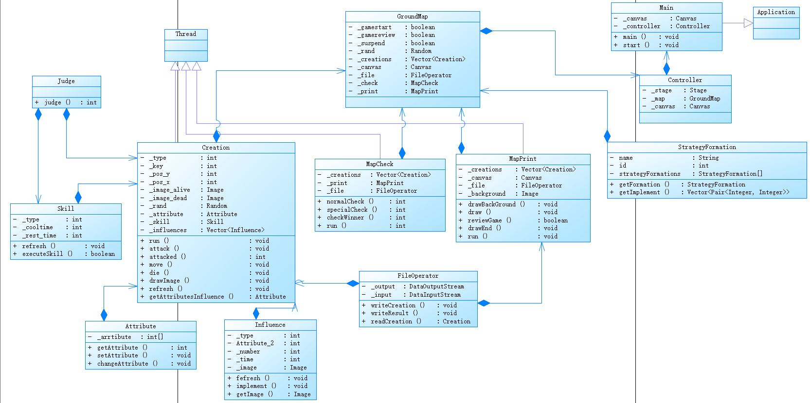
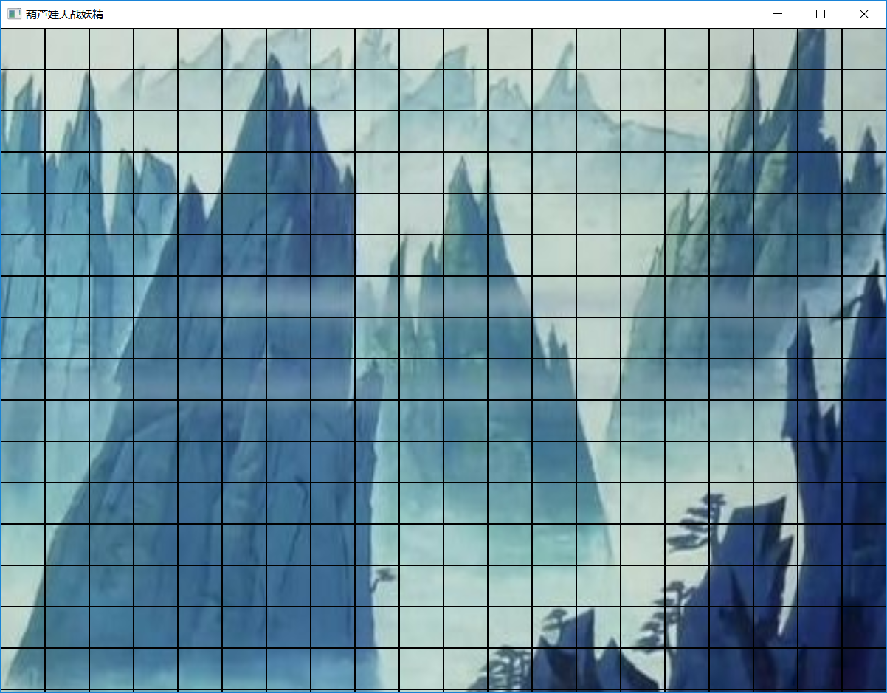
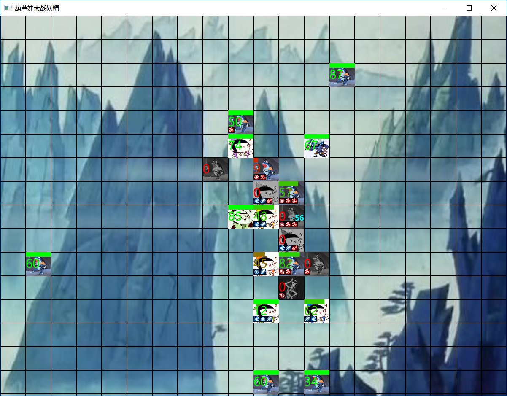
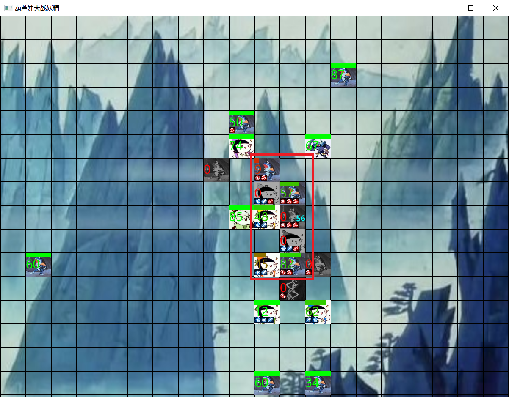
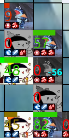
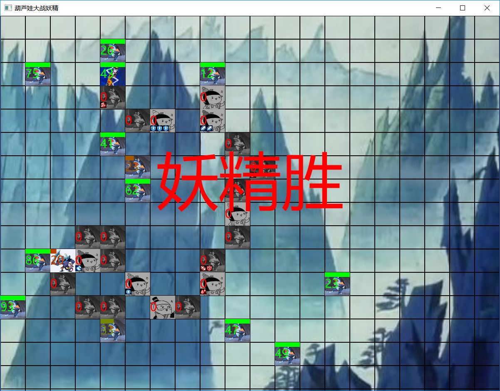

# 一、设计思路  
## （一）需求分析
### 固件需求：
（1）存在一个N*M的二维地图空间  
（2）空间上存在老爷爷、葫芦娃、妖精等生物  
（3）生物之间存在特定阵型  
### 动作需求  
（1）需要进行生物和地图的打印  
（2）每个生物由一个单独的线程操作，独立进行移动、战斗等动作  
（3）当一方生物全部死亡时，结束当前的游戏局  
（4）需要能记录战斗的过程到文件中，并支持读取文件回放  
## （二）模块划分与关系  
### 类图：  
  
本次作业中，主要包括**Main**和**Controller**组成Application必要的两个类，以及**GroundMap(场地)**、**MapPrint（打印）**、**MapCheck（检查）**、**FileOperator（文件操纵）**、**StrategyFormation（阵型）**、**Judge（判断）**、**Creation（生物）**、**Skill（技能）**、**Attribute（属性）**、**Influence（影响）**等类作为内部逻辑。  
**GroundMap**即为总的地图类型，其中设置了诸如屏幕尺寸（像素级）、地图尺寸（生物级）、生物容量等全局限制常量，其他类可以以此作为标准来控制自己的行为。此外，GroundMap还提供对地图的查询功能，比如说生物之间的寻路查询、在地图上查询特定范围的生物、生物阵型的组成等方法。  
**MapPrint**继承自线程类Thread，以特定的时间间隔刷新图片的显示，从而实现游戏的动态打印，主要提供地图打印、生物打印、回放控制等集中于图片打印功能的方法。  
**MapCheck**同样继承自线程类Thread，以固定的间隔检查当前的场地，当场地上的存活生物只有一个阵营，或者虽然存在两个阵营，但是由于死亡个体的阻隔导致游戏无法进行下去时（即平局），修改标志从而终止游戏。  
**FileOperator**文件操纵类，集中于进行文件的输出与读入。输出方法需要一个生物对象，提取生物对象中与打印相关的数据，并按特定格式输出到文件中；输入方法则正好相反，读取文件中特定的数据序列，重新还原出具有相同打印效果的对象（并不是完全相同的对象，具体原因见下文）。
**StrategyFormation**阵型类，通过其提供的方法，可以获得八种阵型的位置序列。  
**Judge**提供一个特殊的方法，与战斗逻辑有关，因为全局通用，所以单独列出来作为一个静态类。  
**Creation**继承自线程类Thread的生物类，满足每个生物由一个单独线程控制的要求，其主要逻辑基本都在在生物对象间进行，对外只提供一个打印图像的方法。  
**Skill**技能类，每个生物均持有一个特定的技能，记录了生物特有的技能，其方法即为技能的执行。  
**Attribute**记录并管理生物的战斗相关属性。  
**Influence**与生物的技能效果直接相关，基于生物的战斗属性提供增益或者削减的效果。  
## （二）战斗逻辑  
### 大体规则  
本次作业中的战斗逻辑参考了COC跑团第七版的战斗规则，并进行了简化而来。首先每个生物线程对象在生成时，读取系统微秒级的时间作为种子，生成一个随机数序列，这个随机数序列将决定生物的整个战斗流程；同时由于生物的创建是串行的，所以微秒级的时间种子确保了每个生物对象的战斗流程都是不同的。接着每个生物具有四大主要属性，攻击Attack、速度Speed、智力Intellect、体质Constitution；这四个属性在生物对象生成时通过前述的随机数序列在100以内的正数中生成；其中Attack决定了生物攻击时的命中概率和伤害大小，Speed决定了生物在遭受攻击时的闪避概率以及运动速度的快慢，Intellect决定了技能释放的成功概率、技能效果量度和技能的释放频率，Constitution决定了初始血量（两者初始数值相等，但并不限制血量的上限）、遭受攻击的伤害减免、削弱性效果持续时间。  
### 具体细节  
（1）判定规则：由Judge类提供，调用生物对象的特定属性A以及其自身保有的随机数序列；首先通过随机数序列生成一个1~100的随机数R，将R与A进行比较可以得到以下等级：失败Fail = 0，R > A || R > 95；成功Success = 1，R <= A；困难成功HardSuccess = 2，R <= A/2；极难成功ExtremeSuccess = 3, R <= A/5；大成功BigSuccess = 4，R <= 5；
超级成功SupperSuccess = 5, R = 1。可以看到当属性值A较高时，其获得成功判定的概率也就越高；但同时无论属性有多高多低，都一定会有5%的小概率成功或者失败。  
（2）攻击判定：生物对象只能攻击临近一个单位（上下左右，斜方向的相邻算作两个单位距离），攻击时需要对Attack属性进行判定，如果结果为失败Fial，则攻击自动失败，不需要进行更多的判定；反之则保留成功等级SA，并在Attack的属性值范围内获得随机数作为伤害值damage，上述数值将分别作为接下来闪避对抗和实际伤害的判定依据。  
（3）闪避对抗：当接收到遭到攻击的信号时，生物首先利用速度Speed尝试进行闪避，针对Speed属性进行判定，获得判定等级为SS，将其与前面的攻击判定等级SA进行比较，如果有闪避等级高于攻击等级SS > SA，则闪避对抗成功，受攻击对象免除本次伤害，否则闪避失败，接着进行受伤数值判定。  
（4）承伤判定：如果生物无法闪避攻击，则必须通过体制来抗下攻击伤害damage，对体质属性Constitution进行判定得到判定等级SC，则实际伤害的计算公式为damage / (SC + 1)，可以看到如果体质判定失败，实际伤害等于初始damage，同时等级越高伤害的减免越高。  
（5）速度判定：每个生物在某回合行动结束后，会产生一定时间的间隔，基础值为1000ms，这个值会通过Speed的判定来进行减免，对于判断等级SS，生物对象的停留间隔为1000 / （1+ss），通过sleep()方法实现。当SS越高时，生物就能更快地进行下一次行动。  
（6）技能判定：每个生物对象都有自己的技能，技能的释放需要进行智力属性Intellect的判定SI，结果为Fail则释放失败，自动进入冷却状态；技能成功释放的时候，这个智力判定等级SI将按比例增强技能的效果，比如蝎子精的技能是召唤小兵，召唤数量与成功等级相同，即成功1个，困难成功2个，极难成功3个，以此类推。  
（7）时间缩短：技能存在冷却时间，效果存在持续时间，这些时间time可以通过判定来缩短：其中技能冷却时间由智力判定缩短，削弱效果作用于生物身体，由体质判定缩短；设判定成功等级为S，则时间缩短为time = time - S。  
### 技能说明
（1）老爷爷：由于葫芦娃是由老爷爷种出来的，所以老爷爷能为一定范围内的存活葫芦娃附加回血效果，同时也能复活一定范围内一定数量的葫芦娃。  
（2）大娃：力大无穷，所以能为自己以及周围一定范围的同伴，附加攻击Attack上升的增益效果。  
（3）二娃：千里眼顺风耳，能提前感知对手的动作，所以可以为较大范围的同伴附加Speed上升增益，并对较大范围的敌人造成Speed下降削弱。  
（4）三娃：金刚不坏，所以能为自己附加体质Constitution的上升增益，同时锋利的金属会造成流血伤害，即附加Health逐渐下降的效果。  
（5）四娃：喷火，经由火焰造成的烧伤，会导致一定范围内对手Attack和Constitution的下降效果。  
（6）五娃：喷水，映射为冰冻效果，寒冷会导致行动和思维的速度下降，即对一定范围内的对手附加Speed和Intellect下降的效果。  
（7）六娃：隐身，因此可以躲避敌人的干扰，为自身附加Speed上升增益，同时可以以隐身的状态去帮助其他同伴，对一定范围内同伴附加Intellect上升增益。  
（8）七娃：吸收葫芦，对一定范围内的敌人造成范围伤害（替代其本回合的攻击行动），同时根据伤害量，按比例恢复自身的生命值Health。  
（9）蝎子精：正如前面所说，可以召唤一定数量的小怪，小怪的出现位置随机。  
（10）蛇精：如意如意随我心意，可以随机释放一个其他角色拥有的技能，只不过需要进行第二次成功鉴定。  
（11）小兵：由于小兵持有兵器，所以小兵的攻击可能会造成流血――Health逐渐下降效果。  
### 平衡性设置  
（1）首先所有生物对象都由随机数生成，同时其战斗流程也由随机数进行判断；同时战斗中存在多个决定属性，某项属性的高低并不具有绝对的优势；所以在属性数值上，双方是平衡的。  
（2）由于蝎子精召唤小兵的技能要优于老爷爷的复活技能，所以为老爷爷增加了回血的技能。  
（3）在整个战斗中，葫芦娃一队必然处于人数上的劣势，所以葫芦娃拥有众多的技能，同时能范围性影响对象；与此同时，小兵的技能范围较小只有一个单位距离，而蛇精的技能需要进行二次判定，提高了失败概率。  
## （三）效果展示  
### 开始截图如下  
  
按下空格开始或者按下L选择文件后，游戏或者回放将自动开始运行，此时如果再次按下空格将会暂停/重启游戏。  
### 战斗截图  
  
其中注意红框圈出来的这一处地方：  
  
放大来：  
  
首先在人物对象的最上方是血量条，血量条会随着血量的下降而缩短，同时逐渐由绿色转变为红色；血量条下方左边的数值显示了剩余血量的数值，与血量条的颜色相同；右方的蓝色数字则显示了受伤情况，闪避成功为“Miss”，否则为伤害数值；最下方一排则显示了对象当前附有的效果，由于尺寸有限最多只能显示4个效果；同时生物对象死亡后，其角色图像会变为暗灰色。  
### 结束截图  
  
游戏运行停止，同时会在屏幕中间以红色字体显示游戏结果。  
此外，以下是各种效果的图标以及代表的作用：  
  Health上升/下降  
  Attack上升/下降  
  Speed上升/下降  
  Intellect上升/下降  
  Constitution上升/下降  
## (四)技术说明  
### 机制  
（1）异常处理：异常处理是指在程序运行时，遇到错误的情况，而这些错误情况是当前阶段的程序无法处理的，这时候就需要结束当前阶段并抛出异常，以通知可能如何解决问题的层次去处理。在本次作业中用到的异常处理主要有：文件读写时会在产生FileNotFoundException和IOEOFException，这些异常会导致程序无法运行，但是不知道该如何处理，所以打印异常信息并退出程序；线程在使用sleep或者wait时，会产生InterruptException异常，而这种异常一般不会影响程序的运行，所以仅捕获即可。  
（2）集合类型、泛型：本次作业中大量使用到了java的集合类型和泛型，比图GroundMap中使用Vector<Creation>来存放生物、StrategyFormation使用Pair<Integer, Integer>来存放位置信息、寻路方法中使用List<Pair>来存放路线。  
（3）测试、注解，本次作业中使用到了Java的测试机制，在maven架构下编写了针对GroundMap、Creation、Influence等类的单元测试用例，测试了其中具有特殊功能的方法。而本次实验中的注解主要使用在测试中，比如@Test、@Before、@After，此外还有在使用EventHandle以及Thread时，使用到了@Override注解。  
（4）输入输出机制：输入输出机制使用了FileInputStream/FileOutputStream，同时将其接到DataInputStream/DataOutputStream上，从而保证将生物对象的特征值输出后，按照固定顺序就可以原封不动地读取回来。  
### 原则  
（1）单一职责原则：此原则是指每个方法都只负责单一的功能。在本次作业中，FileOperator只负责文件输入输出功能，MaoCheck只负责对场地局势的判断功能，StrategyFormation只负责阵型的生成功能。  
（2）迪米特法则：又叫最少知道原则。在本次作业中，类与类之间的通信都使用public方法实现，对于其他类的对象，不能存在直接使用其成员的情况；同时对于需要访问的其他对象，都在自身对象的成员中保留了对其的引用，从而可以直接与这些对象通信。  
### 线程通信与同步  
本次作业中需要线程通信的地方主要有以下几处：首先控制游戏开始的通信GameStart，暂停游戏的通信GameSuspend，这两个通信设置为GroundMap中的两个boolean变量，同时通过设计使得对于任一变量只有一个方法可以修改，而其他线程则通过读取这两个变量来控制自己的逻辑，从而实现游戏开始和暂停的通信。此外每个生物都是独立的个体，他们经由内部逻辑决定行动方式和挂起时间，当攻闪对抗时会产生通信，通过attack和ettacked实现通信。  
对于同步方面，由于GroundMap作为程序的中心，构建了程序运行所需要的所有对象，此外几乎所有对象都保存了GroundMap的引用作为内部成员，所以GroundMap很适合作为程序同步的对象。每个对象在访问会产生错误的临界区时，都会先使用synchronized (GroundMap)进行加锁的操作，比如MapPrint打印画面时、MapCheck检查局势时、Creation行动时。  
