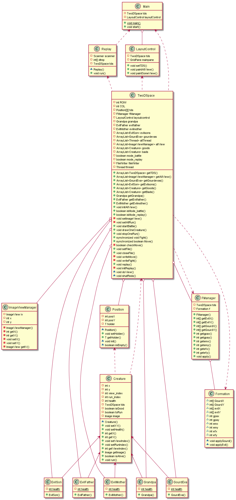
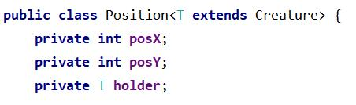
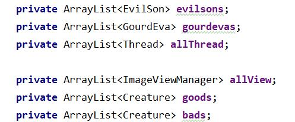
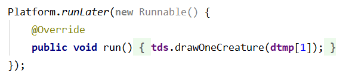
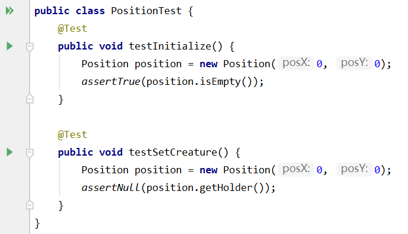
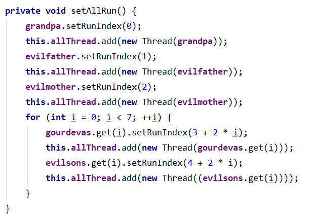
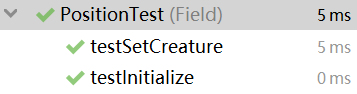

# 葫芦娃大战妖精


### 环境配置

- 【IDE】 IntelliJ IDEA，
- 【图形化框架】 JavaFX


### 项目效果图


### 设计理念 [体现封装继承多态思想]

- **TwoDSpace 二维空间类**
  - 故事主要发生在 **TwoDSpace** 这个类所描绘的二维世界中；
  - 这个二维世界中的 **Creature 生物 **可以分为【两大阵营】，分别是好人方的 **GourdEva 葫芦娃** 和 **Grandpa 爷爷**，以及坏人方的 **EvilFather 蝎子精**、**EvilMother 蛇精** 和 **EvilSon 蛤蟆精**；
  - 二维空间中的每一个基本位置单元，都是一个 **Position 位置** 类，而整个空间则是由 **ROW * COL** 个 **Position** 对象构成的 **ROW 行 COL 列** 的网格世界。
  - 二维空间上的每一个位置可以站立一个 **Creature** 生物，而生物可以移动，生物与生物之间会发生战斗；
  - 刚开始时【两大阵营】会分别**排布**在空间的左右两侧，准备向着对方阵营冲锋杀敌。具体的排布阵型是通过 **FManager 阵型管理类** 来管理布局的；
  - 在空间中，生物的**移动**有一定概率是留在原地不动，稍大的概率是随机向某个方向移动，更大的概率是向着最近的敌人方向移动；
  - 两个生物发生战斗时，会按随机的概率来决定**生死**，因此这是一个很残酷的战场，每个战士都是脆弱而坚强的；
  - **死去**的生物会变成一块墓碑，其他生物将不能够再踏足墓碑所在的位置；
  - 当某一方阵营的生物**全部死去**后，战斗结束；
  - 二维空间中会发生两大阵营之间的**战斗**。战斗可以分为两种，一种是直接开始的第一次战斗，战斗过程会被记录下来；另一种是根据被记录下来的情况回放曾经发生过的战斗；
  - 二维空间会被 **Main** 运行类依据不同的命令以不同的方式唤起，分别采取 **直接开始战斗** 和 **回放战斗** 两种方式执行任务；
  - 二维空间中调用 **LayoutControl 布局控制类** 投影到画布上，并给生物、墓碑等贴上图画；

- **Creature 生物类与各种族**
  - 生物具有的属性包括它的位置（坐标）、对应图画的索引、对应的线程的索引、血值、是否活着的属性、是否还能运动、对应图画；
  - 生物能够派生出所有具体的种族，包括蝎子精、蛇精、蛤蟆精、爷爷、葫芦娃；
  - 而具体的种族类继承自，则主要负责进行对自身特色进行初始化，例如给自己标上属于自己的图画，以及自己所属的好坏阵营等等；
  - 生物类均通过 `implements Runnable `实现，而每个生物均会在线程安排中的行动过程中判断对方阵营残留人数。如果没有剩余就停止行动，而还有剩余则找到离自己最近的目标准备进行移动或者战斗；

- **FManager 阵型管理与阵型**
  - 在阵型管理中，会分别实现好人阵营和坏人阵营的排布；
  - 而阵型类中，设计好在 `15*15` 大小的二维空间中，两方的阵营分别是鹤翼和衡轭阵型；

- **Main 主类**
  - 这是程序启动的入口；
  - 程序开始运行后通过键盘事件 `space` 或者 `L` 来控制下一阶段的开始，分别是直接战斗和战斗回放；
  - 上述的下一阶段开始之前需要选择一个文件，如果是直接战斗，那么这个文件将被用来记录战斗的情况；如果是战斗回放，那么文件里的战斗记录会被读取从而用来还原当时的情况；
  - 确定了下一阶段的任务后，Main 会通过对二维空间对象的控制来进行任务。


### UML 类图

根据代码中类的关系描绘的 UML 类图如下：




### 泛型

程序中有多处使用到**泛型机制**，例如 Position 类的设计。

这里是与前期项目区别比较大的地方，是一个承上启下的环节。先前的 Position 是单纯的用来记录坐标的类，只具有表示横纵坐标的两个成员属性，现在则是将这个类改造成泛型类，且将其成员属性多加一个 holder 用于表示占据了这个位置的生物，这对于项目整体的构造无疑是有优化的作用，提高了复用率和效率。




### 集合框架

Java 集合框架主要包括两种类型的容器，其中一种是集合，它下面是一些抽象类，最后是具体实现类，常用的有 ArrayList 等等。而在程序中，我多次使用了 ArrayList，为项目的实现提供了非常多的便利。




### 异常处理

程序中多次进行异常处理，诸如下类


### 文件 IO

前面提到的，关于战斗的记录读写，都要依赖文件 IO 来实现，核心代码如下。

```{java}
private FileWriter fileWriter;

public void setFile(File file) {
    try {
        fileWriter = new FileWriter(file);
    } catch (Exception e) {
        e.printStackTrace();
    }
}

public void closeFile() {
    if (fileWriter == null) return;
    try {
        fileWriter.close();
    } catch (Exception e) {
        e.printStackTrace();
    }
}
```


### 注解

程序中主要使用了 `@override` 注解，用于检查紧随其后的方法是否是重载方法。如果发现其父类，或者是引用的接口中并没有该方法时，会报编译错误。



另外在单元测试中也用到了 `@Test` 注解。

 


### 多线程

生物类均通过 `implements Runnable` 实现。


后期准备战斗时，会将每个生物装进一个线程中运行。



由于 `synchronized` 是实现线程同步的基本手段，然而底层实现还是通过锁机制来保证，对于被 `synchronized` 修饰的区域每次只有一个线程可以访问，从而满足线程安全的目的。

在程序中则是通过 `synchronized` 修饰战斗和移动函数，来确保多线程的安全。


### 单元测试

项目对某些关键环节进行了测试。例如


上面展示测试的结果如下图。

