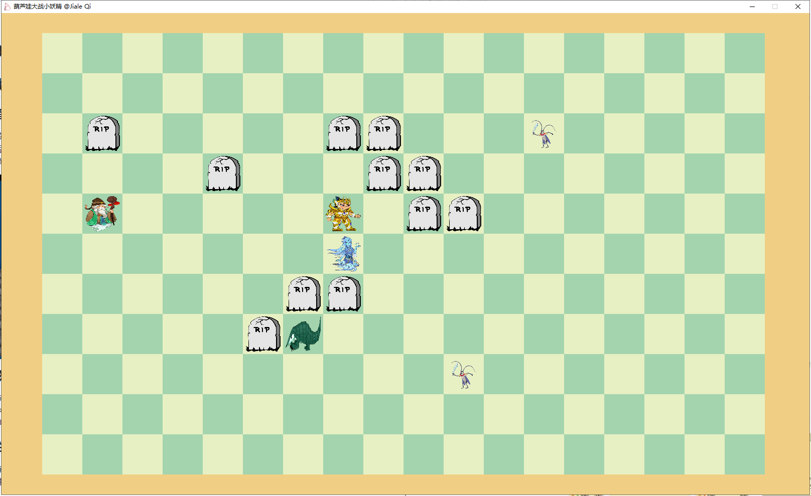

# JAVA Final Homework

## 游戏界面

整个战场由18*11的地砖组成，初始是葫芦娃排长蛇阵站在左边，老爷爷站在葫芦娃身后；妖精阵营，各种小喽啰（小喽啰有不同的外形）呈鹤翼阵站在右边，蛇精和蝎子精站在小喽啰身后。

## 按键操作

打开游戏后，需要按下空格键，之后弹出对话框，选择存档文件，并开始游戏；按下L键加载并回放过去的存档。

## 目录结构

分为controller,formation,gui,life,map5个包.

controller为控制类，包括Check,Controller,Replay三个类，Check类检查战场状态，判断战斗结束，Controller类控制整个战斗流程，Replay类负责回放战斗记录。

formation为阵型，其中包含Formation类，是一切阵型类的基类，另实现了CraneWing鹤翼阵型类，LongSnake长蛇阵型类以及WildGoose雁行阵型类。

gui为绘图相关文件，包括ImageShow类，是图片和坐标的聚合，Layout类负责渲染图形。

life为生物体相关类，其中Life类是其他所有生物体的基类，Grandfather老爷爷，HuluBro葫芦娃，Mob喽啰，Scorpion蝎子精，Snake蛇精。另有Team枚举类，表示葫芦娃阵营和妖精阵营。

map为地图相关类，其中Grid是一个个小单元格，Map是整个战场地图，是非常重要的一个类，另有Move类，是用来记录战斗记录的。

另有Main类，为程序的入口。

另有pic文件夹，存放游戏用到的所有素材。

## 战斗机制

每个角色每次行动时有一般概率向离自己最近的敌人移动，另一半概率向上下左右四个方向随机移动。

当与与敌人直接相遇时，有一般概率战斗死亡，另一半概率存活。

check线程会检查战场剩余的角色身份，当敌方阵营所有成员均死亡时，宣布另一阵营获得胜利（打印输出）。

## 设计思路

沿用了之前作业的部分代码以及设计思路。

## 存档

存档为log1.save文件，replay重放功能仍存bug，可能在战斗中出现角色丢失的情况。(┬＿┬)

## 测试

对Map类中的distance()方法撰写了测试用例，成功通过测试用例，验证了其正确性，

## UML 图

此UML图使用IntelliJ IDEA自动生成.